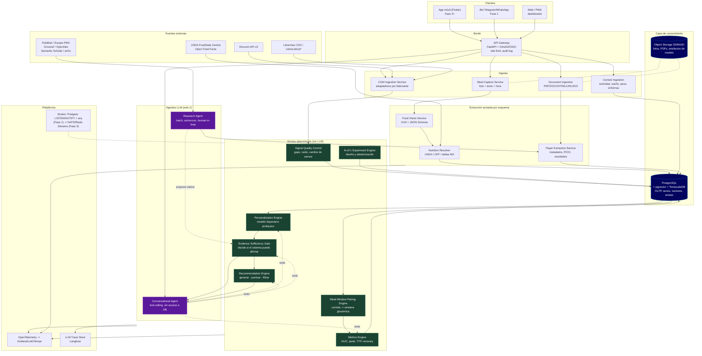
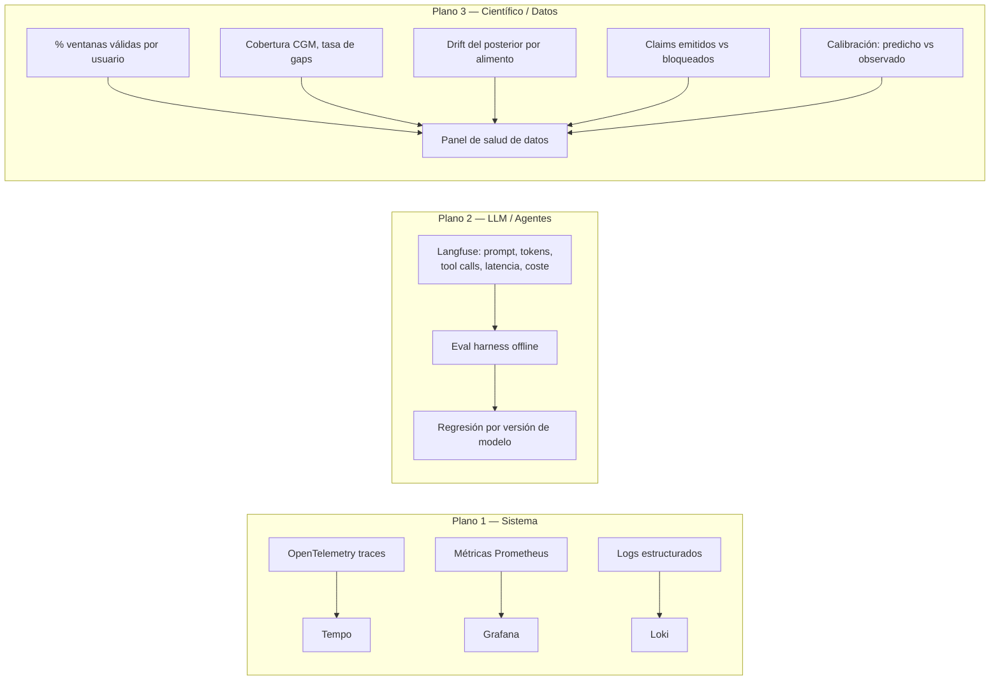
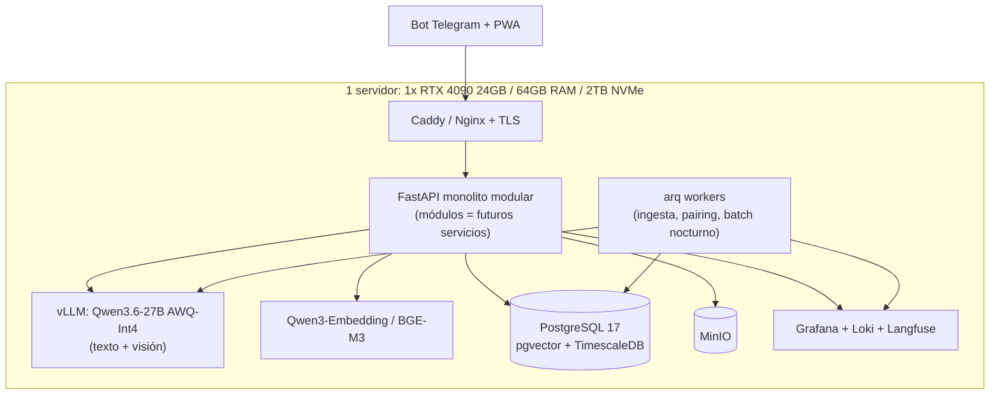
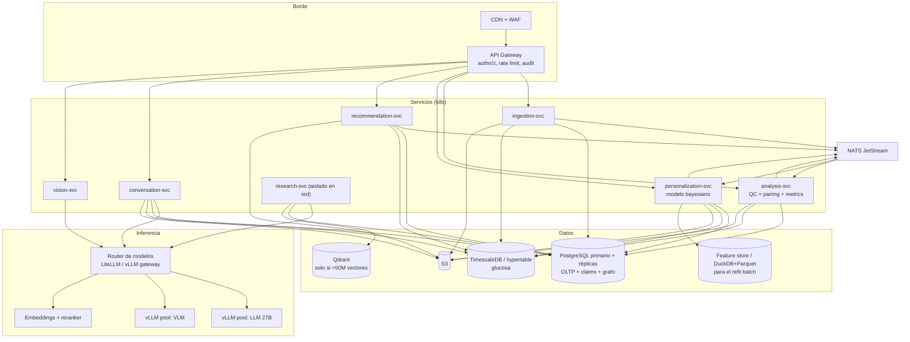

# 01 — Arquitectura de referencia

## 1. Principio rector: separar lo determinista de lo generativo

El error más común en sistemas de salud con LLM es dejar que el modelo generativo toque
el cálculo. Aquí la regla es explícita:

| Capa | Naturaleza | Ejemplos | Requisito |
|---|---|---|---|
| **Núcleo cuantitativo** | Determinista, versionado, testeado | iAUC, time-to-peak, control de calidad de señal, modelo bayesiano, ranking de candidatos | Reproducible bit a bit dado el mismo input + versión de algoritmo |
| **Capa de extracción** | Probabilística acotada por esquema | Visión de alimentos, extracción de metadatos de papers, parsing de PDF | Salida validada contra JSON Schema; siempre con `confidence` y `source_type` |
| **Capa de lenguaje** | Generativa | Conversación, explicación, formulación de queries científicas, síntesis | **Nunca** genera números que no vengan de una tool. Solo redacta. |

Regla operativa: **el LLM conversacional no tiene acceso a la base de datos.** Tiene acceso a
*tools* que devuelven objetos tipados. Si una cifra aparece en la respuesta al usuario y no
proviene de un `tool_result`, es una alucinación por construcción.

---

## 2. Arquitectura general



`*` LibreLinkUp es una API **no oficial, obtenida por ingeniería inversa**. Ver
[07-cgm.md](07-cgm.md) para el análisis legal.

---

## 3. Flujo completo: CGM → comida → análisis → aprendizaje → recomendación

```mermaid
sequenceDiagram
    autonumber
    actor U as Usuario
    participant App as Cliente
    participant Vis as Food Vision
    participant Nut as Nutrition Resolver
    participant CGM as CGM Ingestion
    participant QC as Signal QC
    participant Pair as Pairing Engine
    participant Met as Metrics Engine
    participant Bayes as Personalization Engine
    participant Gate as Evidence Gate
    participant Rec as Recommendation Engine
    participant Chat as Conversational Agent

    Note over U,App: T0 — captura
    U->>App: foto + "tortillas, frijoles, pollo, aguacate" + 13:20
    App->>Vis: imagen + texto libre
    Vis-->>App: items[] con bbox, confidence,<br/>porción estimada (rango), source=OBSERVED|INFERRED
    App->>U: "¿1.5 tortillas o 3? ¿el aguacate es medio o entero?"
    U-->>App: confirma / corrige  → source=USER_REPORTED
    App->>Nut: items confirmados
    Nut-->>App: macros por item (FDC / tabla MX) → source=DATABASE
    App->>Pair: meal persistida con procedencia por campo

    Note over CGM,QC: T0+1h..3h — llega la glucosa (asíncrono)
    CGM->>CGM: pull Dexcom v3 / import CSV LibreView
    CGM->>QC: readings crudas
    QC->>QC: dedup, detectar gaps, warm-up de sensor,<br/>saltos no fisiológicos, cambio de sensor
    QC-->>Pair: serie limpia + flags de calidad

    Note over Pair,Met: T0+3h — emparejamiento
    Pair->>Pair: ventana [t-30, t+180]; ¿cobertura >= 85%?<br/>¿comida solapada < 3h antes? ¿ejercicio en ventana?
    alt ventana válida
        Pair->>Met: serie de la ventana
        Met-->>Pair: baseline, delta_peak, TTP, iAUC120, iAUC180,<br/>tiempo sobre basal, tiempo de retorno, CV
        Pair->>Bayes: MealGlucoseResponse(quality=OK)
    else ventana contaminada
        Pair->>Pair: guardar con quality=EXCLUDED + razón
        Note right of Pair: NO entra al modelo,<br/>pero se conserva para auditoría
    end

    Note over Bayes,Gate: nocturno — reajuste del modelo
    Bayes->>Bayes: refit jerárquico bayesiano<br/>(partial pooling usuario x alimento x contexto)
    Bayes-->>Gate: posteriores + intervalos de credibilidad
    Gate->>Gate: ¿n_exposiciones >= k? ¿HDI excluye ROPE?<br/>¿confusores balanceados? ¿replicación?
    alt suficiente
        Gate->>Gate: emitir PersonalClaim(status=SUPPORTED, grade)
    else insuficiente
        Gate->>Gate: PersonalClaim(status=INSUFFICIENT_DATA)
        Gate->>Rec: sugerir experimento N-of-1
    end

    Note over U,Chat: T+n días — consulta
    U->>Chat: "¿Qué puedo cenar?"
    Chat->>Rec: tool: recommend(context)
    Rec->>Rec: generar candidatos → predecir respuesta →<br/>filtrar por seguridad → puntuar utilidad multiobjetivo
    Rec-->>Chat: 3 opciones + predicción con CI +<br/>evidencia personal + evidencia científica + gaps
    Chat-->>U: recomendación redactada con trazabilidad<br/>y con "lo que NO sé todavía"
```

---

## 4. Componentes: responsabilidades y contratos

### 4.1 CGM Ingestion Service

**Responsabilidad**: convertir cualquier fuente de CGM a un modelo canónico único.
No interpreta, no limpia — solo normaliza y deduplica.

```python
class CGMAdapter(Protocol):
    vendor: str  # "dexcom" | "libre_csv" | "librelinkup" | "nightscout"

    async def fetch(self, since: datetime, until: datetime) -> list[RawReading]: ...
    def capabilities(
        self,
    ) -> AdapterCapabilities: ...  # latencia, resolución, ¿trend?, ¿calibración?
```

Canónico:

```python
@dataclass(frozen=True)
class RawReading:
    user_id: UUID
    ts_utc: datetime  # systemTime, no displayTime
    tz_offset_min: int  # se conserva aparte, para análisis por hora local
    value_mgdl: float
    vendor: str
    device_serial_hash: str  # hash, no el serial: PII
    sensor_session_id: str  # crítico: permite excluir warm-up y detectar saltos entre sensores
    trend: TrendDirection | None
    ingest_batch_id: UUID
```

Decisiones no obvias:
- **`ts_utc` desde `systemTime`, nunca `displayTime`.** La API de Dexcom expone ambos; `displayTime`
  puede estar desfasado si el reloj del receptor está mal. El offset se guarda por separado
  porque el análisis "efecto de la hora del día" necesita hora **local**.
- **`sensor_session_id` es obligatorio.** Sin él no puedes excluir el periodo de warm-up ni
  detectar el escalón entre sensores, que es la mayor fuente de sesgo espurio.
- **Idempotencia por `(user_id, ts_utc, vendor)`** con `ON CONFLICT DO NOTHING`. Los CSV se
  reimportan solapados todo el tiempo.

### 4.2 Signal Quality Control

Determinista. Marca, no borra. Ver detalle en [02-nucleo-cientifico.md](02-nucleo-cientifico.md).

### 4.3 Meal-Window Pairing Engine

El componente más subestimado y el que más determina la calidad del producto.
Responde: *¿esta ventana de glucosa es atribuible a esta comida?* En la mayoría de los
casos de la vida real, **la respuesta es no**, y el sistema debe decirlo.

### 4.4 Evidence Sufficiency Gate

Único componente autorizado a promover una observación a **claim**. Sin él, el sistema
degenera en un generador de correlaciones espurias con voz autoritaria.

```python
class SufficiencyVerdict(BaseModel):
    can_assert: bool
    grade: Literal[
        "A_PERSONAL_REPLICATED", "B_PERSONAL_OBSERVATIONAL", "C_POPULATION_PRIOR", "D_INSUFFICIENT"
    ]
    n_exposures: int
    posterior_mean: float
    hdi_95: tuple[float, float]
    rope_excluded: bool  # el intervalo excluye la región de equivalencia práctica
    confounders_checked: list[str]
    blocking_reason: str | None
    suggested_experiment: ExperimentSpec | None
```

### 4.5 Conversational Agent

- **Sin acceso directo a SQL.** Solo tools tipadas.
- **System prompt con contrato de citación**: toda cifra debe venir con su `claim_id` o
  `paper_id`; el post-procesador rechaza respuestas con números no rastreables.
- **Guardrail de salida** (determinista, no LLM): regex + verificación de que cada número
  citado existe en algún `tool_result` de la conversación. Si no, se re-genera o se degrada
  a respuesta cualitativa.

### 4.6 Research Agent

Batch, asíncrono, **nunca en la ruta de una respuesta al usuario**. Detalle completo en
[03-evidencia-y-research-agent.md](03-evidencia-y-research-agent.md).

---

## 5. APIs internas (contratos principales)

```
POST /v1/meals                     → crea comida (multipart: foto + json)
GET  /v1/meals/{id}/response       → MealGlucoseResponse + quality flags
POST /v1/cgm/import                → CSV LibreView (multipart)
POST /v1/cgm/sync/{provider}       → dispara pull OAuth (Dexcom)
GET  /v1/glucose?from&to&agg       → serie, con downsampling server-side
GET  /v1/insights/foods            → ranking de alimentos con n, posterior, CI, grade
GET  /v1/insights/claims/{id}      → claim + cadena completa de evidencia
POST /v1/recommendations           → { context } → candidatos puntuados + explicación
POST /v1/experiments               → propone/acepta un ensayo N-of-1
POST /v1/library/documents         → ingesta de paper (url|doi|pdf|docx|texto)
POST /v1/chat                      → SSE stream; el agente conversacional
```

**Regla de diseño de la API**: todo endpoint que devuelva una cifra derivada devuelve también
`{ value, ci_low, ci_high, n, quality, algorithm_version, provenance }`. Nunca un escalar
desnudo. Esto obliga a que la UI y el LLM tengan que enfrentarse a la incertidumbre.

---

## 6. Eventos, batch y tiempo real

El sistema es **fundamentalmente asíncrono** porque la glucosa llega tarde: la API de Dexcom
sirve datos con **1 hora de retraso en servidores de EE. UU. y 3 horas fuera de EE. UU.**
(los datos subidos por receptor USB están disponibles de inmediato). No existe *pipeline*
en tiempo real para el análisis de comidas, y **eso está bien**: la ventana postprandial
relevante es de 3 horas de todos modos.

| Modo | Qué corre | Latencia objetivo |
|---|---|---|
| **Interactivo** | Visión de alimentos, chat, lectura de insights ya calculados | < 3 s (visión < 8 s) |
| **Near-real-time (evento)** | Ingesta CGM, QC, disparo de pairing cuando la ventana se completa | minutos |
| **Batch nocturno** | Refit del modelo bayesiano, recálculo de claims, evaluación del Evidence Gate, detección de anomalías | 1×/día |
| **Batch semanal** | Research Agent (vigilancia de literatura), reindexado de embeddings, reporte de tendencias | 1×/semana |

**Broker**: en Fase 1, `PostgreSQL LISTEN/NOTIFY` + `arq` (Redis) o incluso una tabla de
outbox con polling. Kafka/NATS es sobreingeniería hasta que haya >1k usuarios activos.
El disparador para migrar: cuando el batch nocturno no quepa en su ventana, o cuando
necesites replay de eventos para auditoría regulatoria.

---

## 7. Seguridad

| Control | Implementación |
|---|---|
| **Autenticación** | OIDC. Fase 1: Keycloak o Authentik self-hosted (evita depender de un proveedor SaaS con datos de salud). Passkeys/WebAuthn > password. |
| **Autorización** | Row-Level Security en PostgreSQL con `app.current_user_id`. Es la única defensa que sobrevive a un bug en el ORM. |
| **Cifrado en tránsito** | TLS 1.3 obligatorio, HSTS, cert pinning en la app móvil. |
| **Cifrado en reposo** | Cifrado de disco completo + **cifrado a nivel de columna** para campos especialmente sensibles (notas de síntomas, condiciones médicas) con `pgcrypto` y claves en un KMS/Vault separado del servidor de DB. |
| **Fotos de comida** | Object storage privado, URLs pre-firmadas con TTL corto. **Strip EXIF en ingesta** — el GPS de una foto de comida es geolocalización médica. |
| **Aislamiento del LLM** | El modelo local no tiene salida a internet. El Research Agent sí, pero corre en un namespace de red separado y **nunca recibe datos de usuario en su prompt**. |
| **Prompt injection** | Amenaza real: un PDF científico subido por el usuario o una página web recuperada por el Research Agent puede contener instrucciones. Mitigación: contenido recuperado va siempre en bloques delimitados marcados como *datos*, el agente no tiene tools de escritura destructiva, y toda promoción de claim pasa por el Evidence Gate determinista (no por el LLM). |
| **Auditoría** | Log append-only de todo acceso a datos de salud: `who, what, when, why, which_rows`. Requisito de facto de LFPDPPP y GDPR. |
| **Secretos** | Vault / SOPS. Nunca en el repo, nunca en variables de entorno de Docker Compose commiteadas. |
| **Borrado** | Borrado real en cascada + tombstone en el log de auditoría. Los embeddings derivados también deben borrarse (son datos personales derivados). |

### Modelo de amenazas resumido

1. **Exfiltración de datos de salud** → RLS + cifrado de columna + auditoría.
2. **Prompt injection vía documento científico** → separación datos/instrucciones + gate determinista.
3. **Inferencia de identidad desde datos agregados** → el modelo poblacional se entrena con
   *k*-anonimato mínimo y sin identificadores; ver [08-regulatorio.md](08-regulatorio.md).
4. **Daño clínico por consejo erróneo** → el Evidence Gate y los límites de
   [08-regulatorio.md](08-regulatorio.md) son controles de *seguridad*, no de producto.

---

## 8. Observabilidad

Tres planos, no uno:



**El plano 3 es el que nadie construye y el que más importa aquí.** Métricas obligatorias:

- `pairing_valid_ratio` — % de comidas con ventana glucémica utilizable. Si cae debajo de ~60%
  el producto no funciona, aunque todos los servicios estén verdes.
- `cgm_coverage_pct` por usuario y día.
- `claims_blocked_by_gate` desglosado por razón — es el mapa de qué le falta al sistema.
- **Calibración predictiva**: reliability diagram de `iAUC` predicho vs. observado. Si el
  modelo dice "80% de probabilidad de pico < 140" debe acertar el 80% de las veces.
  Sin esto, el motor de recomendaciones es decorativo.
- `vision_correction_rate` — % de items que el usuario corrige tras la estimación visual.
  Es la medida directa de la utilidad del VLM.

---

## 9. Dos arquitecturas: simple para empezar, objetivo para producción

### 9.1 Arquitectura simple (Fase 1–2) — un solo host



Todo en Docker Compose. **Un monolito modular en Python**, con los módulos separados por
frontera de dominio para que la extracción posterior a servicios sea mecánica.
No microservicios: con un equipo de 1–3 personas los microservicios son un impuesto puro.

### 9.2 Arquitectura objetivo (producción, >1k usuarios)



**Disparadores explícitos para migrar** (no migres antes):

| De | A | Disparador |
|---|---|---|
| Postgres tabla plana | TimescaleDB hypertable | > ~100M filas de glucosa, o el batch nocturno tarda > 2h |
| pgvector | Qdrant | > 50M vectores, o necesitas BM25 nativo/multi-tenant duro |
| Tabla de aristas | Neo4j / Memgraph | consultas de camino de > 3 saltos en caliente, o > 10⁶ aristas |
| LISTEN/NOTIFY + arq | NATS JetStream | necesitas replay de eventos o >1 instancia de worker por tipo |
| Monolito | Servicios | cuando 2 equipos distintos toquen el mismo repo a diario |

`pgvector` 0.8.0 es válido en producción hasta el orden de 50–100M vectores; para un corpus
científico de ~10⁵–10⁶ chunks, ni te acercas al límite.
