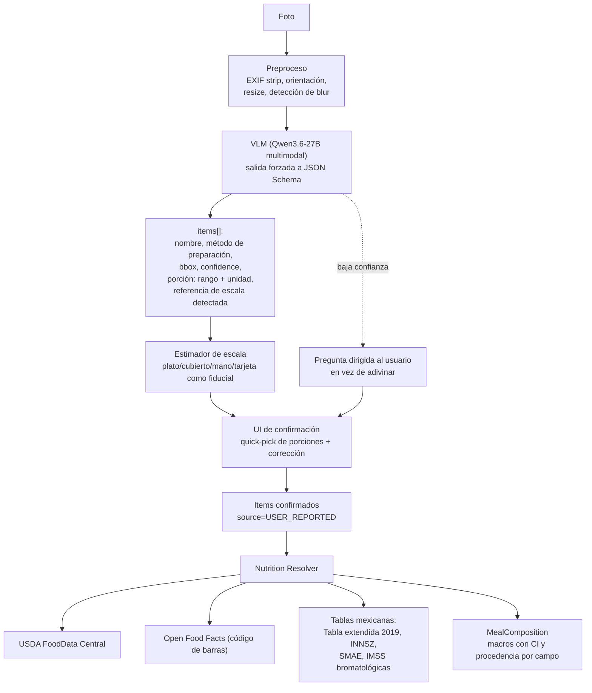
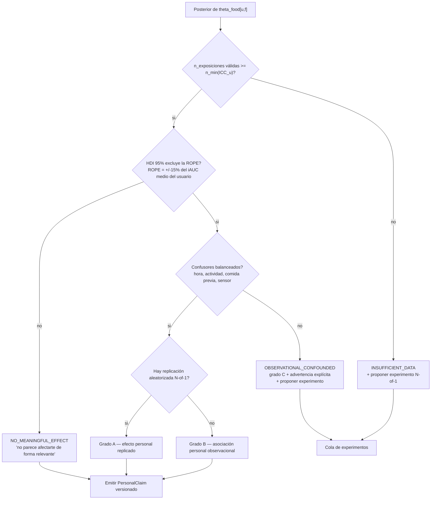

# 02 — Núcleo científico: glucosa, visión de alimentos y personalización

## Parte A — Análisis de glucosa

### A.1 Qué métricas tienen respaldo y cuáles no

| Métrica | Definición | Respaldo | Uso recomendado aquí |
|---|---|---|---|
| **iAUC (incremental AUC)** | Área trapezoidal sobre la línea basal, ignorando el área bajo la basal | Estándar de facto en investigación de respuesta postprandial; es la métrica del método FAO/OMS de índice glucémico y la usada en PREDICT y en el estudio de comidas duplicadas | ✅ **Métrica primaria.** Reportar iAUC-120 **y** iAUC-180 |
| **Δ pico (incremento máximo)** | `max(G) - baseline` | Muy usado, intuitivo, correlaciona con iAUC | ✅ Secundaria. Es lo que el usuario entiende |
| **Tiempo hasta el pico (TTP)** | `argmax(G) - t_meal` | Descriptivo, respaldado; distingue perfiles rápidos vs. lentos | ✅ Secundaria. Útil para caracterizar forma |
| **Glucosa basal / preprandial** | Mediana de `[t-20, t-5] min` | Necesaria para iAUC; usar mediana, no un punto único (robustez al ruido) | ✅ Covariable obligatoria |
| **Tiempo por encima de basal + N** | Minutos con `G > baseline + 30` | Razonable, poco estandarizado | ⚠️ Exploratoria |
| **Tiempo de retorno a basal** | Primer `t` con `G <= baseline + 10` sostenido 15 min | Descriptivo; sensible a comidas solapadas | ⚠️ Exploratoria; requiere ventana limpia |
| **CV, SD (variabilidad)** | Consenso internacional: **CV ≤ 36%** como umbral de estabilidad | Fuerte respaldo *a nivel de día/periodo*, **no** a nivel de comida | ✅ Solo a nivel diario/semanal |
| **Time in Range (70–180 mg/dL)** | Consenso internacional 2019, incorporado a los estándares ADA desde 2020 | Fuerte, pero definido para **población con diabetes** | ⚠️ Reportar como contexto diario; los objetivos de TIR **no aplican** a normoglucémicos |
| **MAGE** | Mean amplitude of glycemic excursion | Diseñado para variabilidad *diaria*, no para una comida | ❌ No usar por comida |
| **"Glucose spike score", "metabolic score"** | Índices propietarios de apps comerciales | Sin validación independiente | ❌ No inventar índices compuestos |

**Recomendación**: métrica primaria **iAUC-120** (comparabilidad con la literatura),
con **iAUC-180** como secundaria porque comidas mexicanas altas en grasa/proteína
(p. ej. tacos de carne con aguacate) desplazan la respuesta más allá de 2 h y iAUC-120
las subestima sistemáticamente.

**No inventes un índice compuesto.** Cada métrica derivada nueva es una hipótesis sin validar
que el sistema va a tratar como hecho.

### A.2 Ejemplo trabajado con los datos del brief

```
t=-0   92 mg/dL   (basal)
t=30  105
t=60  142
t=90  158
t=120 130
t=180 105
```

Con muestreo real de 5 min esto son ~37 puntos; con los 6 puntos dados, regla trapezoidal
sobre incrementos (`G - 92`, truncando negativos a 0):

- Δ pico = **66 mg/dL** (a t=90)
- TTP = **90 min**
- iAUC-120 ≈ 30/2·(0+13) + 30/2·(13+50) + 30/2·(50+66) + 30/2·(66+38) = **4,440 mg/dL·min**
- iAUC-180 ≈ 4,440 + 60/2·(38+13) = **5,970 mg/dL·min**

Y aquí viene lo importante: **este resultado, solo, no significa nada.** Es una muestra de una
distribución cuya varianza intraindividual conocida es enorme. Ver A.4.

### A.3 Problemas reales de los CGM y cómo se manejan

| Problema | Realidad medida | Mitigación en el diseño |
|---|---|---|
| **Retraso intersticial** | La glucosa intersticial va **5–15 min por detrás** de la sanguínea; el error crece cuando la glucosa cambia rápido | No "corregir" el retraso con deconvolución (introduce artefactos). En su lugar: usar la misma convención siempre, comparar comidas entre sí (el sesgo se cancela), y **nunca** afirmar TTP con precisión mayor a ±15 min |
| **Frecuencia de muestreo** | Dexcom ~5 min. **FreeStyle Libre 2 Plus (el disponible en México): mide cada 1 min pero almacena y exporta cada 15 min** | 🔴 **Detectar la resolución empíricamente** (mediana de diferencias consecutivas por sesión), nunca asumirla. Todas las reglas de QC, la ventana de basal y los umbrales de gap son **funciones de la resolución nativa**. Calcular el iAUC directamente sobre los tiempos reales de muestreo (la interpolación lineal previa no cambia el trapecio; sólo añade puntos falsos). Ver [07-cgm.md §1.1](07-cgm.md) |
| **Subestimación del pico por muestreo** | Con 15 min, el apex real cae entre muestras | Reportar el pico como **cota inferior** con la bandera `peak_underestimated` cuando `resolución > 5 min`. Nunca compararlo con valores de otra resolución |
| **Ruido** | MARD global reportado ~8–9% en G7 y Libre 3 Plus; estudios head-to-head independientes dan cifras dispares (p.ej. 11.4% Libre 3 vs 18.5% G7 frente a capilar en una serie) ⚠️ heterogeneidad metodológica alta | Filtro de mediana móvil de 3 puntos **solo** para la detección del pico; el iAUC se calcula sobre la señal cruda (el filtrado sesga el área) |
| **Datos faltantes** | Frecuentes: sensor fuera de rango del teléfono, ducha, sueño boca abajo | Regla dura: gap > 20 min dentro de `[t, t+120]` ⇒ ventana **excluida**. Cobertura mínima 85% de puntos esperados. No imputar dentro de la ventana de análisis |
| **Warm-up del sensor** | El error es aproximadamente **el doble en las primeras ~12 h** | Excluir las primeras **12 h** de cada `sensor_session_id` del análisis de comidas. Es caro (≈3.5% de los datos en Libre 14 días) y es correcto |
| **Cambio de sensor** | Escalón sistemático entre sensores | `sensor_session_id` como efecto aleatorio en el modelo. Detectar escalón comparando medianas de 6 h alrededor del cambio; si `|Δ| > 15 mg/dL`, marcar |
| **Calibración** | Libre 3 y G7 son de calibración de fábrica; G6 permitía calibración opcional | Guardar eventos de calibración si el vendor los expone (`/v3/users/self/calibrations` en Dexcom) y marcar ventanas post-calibración |
| **Diferencias entre fabricantes** | En PREDICT, el CV del iAUC-2h fue **3.7% intra-marca** vs **12.5% entre marcas** | **Nunca mezclar marcas dentro de un mismo análisis comparativo.** El fabricante entra como efecto fijo; si el usuario cambia de marca, el histórico previo se marca como cohorte distinta |
| **Sensor despegado / compresión nocturna** | "Compression lows" por dormir sobre el sensor | Detector: caída > 30 mg/dL en < 15 min seguida de recuperación en < 30 min sin comida registrada ⇒ marcar como artefacto, no como hipoglucemia |
| **Errores groseros** | Valores fuera de 40–400 mg/dL, o Δ > 6 mg/dL/min sostenido | Filtro de plausibilidad fisiológica; marcar, no borrar |

### A.4 El problema de fondo: la respuesta a una comida es poco reproducible

Este es el resultado que debe estar impreso en la pared del equipo:

> 30 adultos sin diabetes, régimen intrahospitalario, 1,189 respuestas a **comidas duplicadas**
> presentadas con ~1 semana de separación, 4 patrones dietéticos.
> Correlación intrasujeto entre iAUCs duplicados: **r = 0.47 (Abbott)**, **r = 0.43 (Dexcom)**.
> ICC: **0.31 (Abbott)**, **0.14 (Dexcom)**.
> La variabilidad entre comidas duplicadas fue **similar** a la variabilidad entre comidas distintas.
> — [Hall/Chung et al., AJCN 2024](https://ajcn.nutrition.org/article/S0002-9165(24)00814-1/abstract)

Un ICC de 0.14–0.31 significa que **69–86% de la varianza observada en una comida individual
no es atribuible a la comida.** Consecuencias de diseño, todas obligatorias:

1. **Número mínimo de exposiciones.** Con ICC ≈ 0.3, para que la media de `n` repeticiones
   tenga fiabilidad ≥ 0.8 se necesita, por Spearman-Brown, `n ≥ 0.8(1-0.3) / (0.3(1-0.8)) ≈ 9`.
   Con ICC ≈ 0.15, `n ≈ 23`. → **El umbral por defecto del Evidence Gate es n ≥ 8 exposiciones
   válidas** para un claim personal observacional, y se calcula dinámicamente a partir del ICC
   estimado del propio usuario.
2. **Reportar siempre la distribución, no la media.** "En 9 ocasiones: mediana +48 mg/dL,
   rango 21–79" en vez de "produce +48".
3. **Aleatorización cuando importa.** Para claims causales (grado A), el motor N-of-1 propone
   secuencias contrabalanceadas A/B en días alternos, controlando hora del día.
4. **Estos ICC son de adultos *sin* diabetes.** ⚠️ En personas con disglucemia la señal es
   mayor y el ICC probablemente mejor, pero no tengo una cifra verificada; el sistema debe
   estimar el ICC empíricamente por usuario en lugar de asumirlo.

### A.5 Reglas del Meal-Window Pairing Engine

Todos los umbrales son **funciones de la resolución nativa detectada** (`res`), no constantes:

```python
VALID_WINDOW = {
    "pre_window_min": lambda res: max(30, 2 * res + 10),  # 40 min con res=15
    "post_window_min": 180,
    "baseline_window_min": lambda res: max(20, 2 * res),  # 30 min con res=15 -> 2-3 puntos
    "baseline_stat": "median",
    "max_gap_min": lambda res: max(20, 2.5 * res),  # 37.5 min con res=15
    "min_coverage_pct": 85,  # contra puntos ESPERADOS a resolución nativa
    "exclude_if_prior_meal_within_min": 180,  # comida solapada previa
    "exclude_if_next_meal_within_min": 120,  # no cabe ni iAUC-120
    "degrade_if_next_meal_within_min": 180,  # iAUC-180 = None
    "analysis_warmup_hours": 12,  # != warm-up del fabricante (1 h)
    "flag_if_activity_in_window": True,  # no excluir: es covariable
    "flag_if_sleep_overlap": True,
    "exclude_if_vendor_changed_within_h": 24,
}
```

Dos reglas que suelen olvidarse y que sí están implementadas:

- **La comida *siguiente* contamina tanto como la anterior.** Si la próxima comida cae antes
  de `t+120`, la ventana se excluye; entre `t+120` y `t+180`, se calcula iAUC-120 pero
  `iauc_180 = None` y la calidad baja a `degraded`.
- **El warm-up de análisis (12 h) no es el warm-up del fabricante (~1 h).** El primero
  responde al error elevado documentado en las primeras horas del sensor; el segundo sólo a
  que el sensor empiece a reportar. Con sensores de **15 días**, excluir 12 h cuesta ~3.3%
  de los datos.

Toda ventana excluida se **conserva** con `quality_flag` y `exclusion_reason`. Dos motivos:
auditoría, y porque el ratio de exclusión es una métrica de producto (si excluyes el 70% de
las comidas, el problema es de UX de registro, no de estadística).

---

## Parte B — Visión de alimentos

### B.1 ¿Qué tan viable es esto hoy? Con números

Evaluación independiente de 3 MLLM sobre **52 fotografías estandarizadas** (16 alimentos
individuales, 36 comidas completas, en 3 tamaños de porción):

| Modelo | MAPE peso | MAPE energía | Correlación vs. referencia |
|---|---|---|---|
| ChatGPT-4o | 36.3% | 35.8% | 0.65–0.81 |
| Claude 3.5 Sonnet | 37.3% | — | 0.65–0.81 |
| Gemini 1.5 Pro | 64.2% | 64.2–109.9% (por nutriente) | 0.58–0.73 |

Conclusión de los autores: comparable a los métodos tradicionales de autorreporte dietético
**sin la carga para el usuario**, pero con **subestimación sistemática de porciones grandes** y
alta variabilidad en macronutrientes → **no apto para cuantificación clínica precisa**.
— [PubMed 41081011](https://pubmed.ncbi.nlm.nih.gov/41081011/)

**Lectura para este proyecto**: un ±36% en la estimación de carbohidratos, propagado a un
modelo de dosis-respuesta, hace imposible distinguir "el arroz te sube más que la pasta" de
ruido de medición. **La visión sola no es suficiente. El cuello de botella no es el
reconocimiento del alimento — es la porción.**

### B.2 Arquitectura del Food Vision Service



### B.3 Procedencia: el requisito explícito del brief

Cada campo nutricional lleva su origen. Esto no es metadato decorativo: **determina el peso
del dato en el modelo estadístico** (la varianza de medición entra en la verosimilitud).

```python
class Provenance(StrEnum):
    OBSERVED = "observed"  # visible directamente en la foto: "hay tortillas"
    INFERRED = "inferred"  # deducido: "probablemente fritas por el brillo"
    USER = "user_reported"  # el usuario lo dijo o confirmó
    DATABASE = "database"  # tabla de composición
    DEFAULT = "assumed_default"  # supuesto del sistema, el más débil


class NutrientEstimate(BaseModel):
    value: float
    unit: str
    provenance: Provenance
    ci_low: float | None
    ci_high: float | None
    confidence: float  # 0..1
    source_ref: str | None  # fdc_id, código de barras, id de tabla MX
    method_version: str
```

Regla de UI: los valores `INFERRED` y `DEFAULT` se muestran **en gris y con rango**, nunca como
un número exacto. El usuario ve la diferencia entre "45 g" y "35–60 g (estimado)".

Regla de modelo: la varianza de medición se propaga. Un item con procedencia `DEFAULT`
contribuye con una verosimilitud mucho más ancha que uno con código de barras escaneado.
Esto hace que el sistema, automáticamente, aprenda más rápido de los usuarios que registran
mejor — sin necesidad de reglas ad hoc.

### B.4 Estrategias para el problema de la porción (ordenadas por costo/beneficio)

1. **Quick-pick calibrado por usuario** (mejor ROI): la primera vez que aparece "tortilla",
   el usuario define *su* tortilla (diámetro, o "las de mi tienda") y se guarda como
   `user_food_portion_default`. A partir de ahí, la foto sólo tiene que decidir *cuántas*.
   Contar objetos discretos es mucho más fiable que estimar volumen.
2. **Fiducial en la foto**: pedir que aparezca un objeto de referencia conocido (la propia mano
   del usuario, calibrada una vez; una tarjeta; el plato registrado con su diámetro).
3. **Dos ángulos** (cenital + lateral) cuando el usuario quiera precisión. Mejora el volumen
   sustancialmente y es gratis.
4. **Códigos de barras** para productos empaquetados → Open Food Facts. Precisión casi
   perfecta cuando aplica. ⚠️ Open Food Facts es colaborativo y sin garantía de exactitud;
   validar rangos y preferir FoodData Central cuando exista match.
5. ❌ **No** invertir en estimación volumétrica por deep learning propia. Es un doctorado
   y el retorno frente a (1) es marginal.

### B.5 Cobertura para comida mexicana

USDA FoodData Central (~380k alimentos) cubre mal la cocina mexicana casera. Fuentes
complementarias necesarias:

- **Tabla de composición de alimentos extendida 2019** — 3,928 registros, distribuida vía
  CONABIO/SIAGRO.
- **Tablas de Composición de Alimentos y Productos Alimenticios Mexicanos** (INNSZ).
- **SMAE** (Sistema Mexicano de Alimentos Equivalentes) — no es una tabla de composición
  estricta sino un sistema de equivalencias por grupo; útil para la UI de porciones.
- **Tablas bromatológicas del Cuadro Básico del IMSS**.
- **LATINFOODS / FAO INFOODS** para regionalización.

Plan: construir un **catálogo canónico propio** (`food` + `food_alias` + `food_component`) que
mapee a estas fuentes con `source_priority`, en vez de consultar APIs externas en caliente.
Los platillos compuestos ("pozole", "chilaquiles") se modelan como **recetas** con
componentes y proporciones editables por el usuario, no como entradas monolíticas — porque
el objetivo es aprender qué *componente* mueve la glucosa.

---

## Parte C — Motor de personalización estadística

### C.1 Justificación de cada técnica (y qué descarto)

El brief pide justificar y no meter ML por meterlo. Mi posición:

| Técnica | ¿Se usa? | Justificación |
|---|---|---|
| **Modelo bayesiano jerárquico / mixed-effects** | ✅ **Núcleo del sistema** | Es *exactamente* la estructura del problema: observaciones anidadas en comidas, anidadas en usuarios; n pequeño por celda; necesidad de encoger hacia la media poblacional cuando faltan datos y de liberarse cuando sobran; incertidumbre nativa en la salida. Resuelve directamente el requisito "Usuario A ≠ Usuario B" |
| **Time-series analysis** | ✅ Acotado | Para QC de señal, detección de artefactos y descomposición circadiana de la basal. **No** para forecasting de glucosa (eso es territorio de dispositivo médico) |
| **Anomaly detection** | ✅ Acotado | Detección de compression lows, saltos de sensor, comidas no registradas (un pico sin comida = recordatorio, no diagnóstico) |
| **Causal inference** | ✅ Pero honesto | *Target trial emulation* + ajuste por confusores conocidos (hora, actividad previa, sueño, comida anterior, orden de ingesta) sobre datos observacionales; y **aleatorización real** vía N-of-1 para claims de grado A. Un DAG explícito, no "causal ML" |
| **Clustering** | ⚠️ Solo exploratorio | Agrupar *formas de curva* (rápida/lenta/bifásica) es útil descriptivamente. Agrupar usuarios en "metabotipos" es tentador y **muy propenso a hallazgos espurios** con n pequeño. No exponer al usuario |
| **Personalized ML (GBM tipo Zeevi)** | ⏳ Fase 5, no antes | Zeevi et al. usaron n=800 personas y ~46,898 comidas para entrenar su gradient boosting. Con 1–50 usuarios, un GBM personalizado sobreajusta ruido. **El jerárquico bayesiano domina en el régimen de datos escasos** |
| **Deep learning sobre la curva** | ❌ No | No hay datos suficientes, no es interpretable, y no aporta sobre el jerárquico en este régimen |
| **Reglas deterministas** | ✅ | Seguridad clínica, elegibilidad de recomendaciones, QC. Todo lo que debe ser auditable |

### C.2 El modelo

Especificación (notación tipo Stan/PyMC, `y` = iAUC-120 log-transformado — la distribución de
iAUC es fuertemente asimétrica a la derecha):

```
y[i] ~ StudentT(nu, mu[i], sigma_resid[u[i]])          # T de Student: robusta a outliers

mu[i] = alpha[u[i]]                                    # intercepto por usuario
      + beta_carb[u[i]] * carb_g[i]                    # pendiente de carbohidratos POR USUARIO
      + beta_fib[u[i]]  * fiber_g[i]
      + beta_prot[u[i]] * protein_g[i]
      + beta_fat[u[i]]  * fat_g[i]
      + f_hour(hour_local[i])                          # spline cíclico: efecto hora del día
      + gamma_baseline * (baseline[i] - mean_baseline)
      + delta_activity * activity_prev_2h[i]
      + delta_sleep    * sleep_debt[i]
      + eta_order[order_pattern[i]]                    # carbs-last vs mixto vs carbs-first
      + theta_food[u[i], food[i]]                      # efecto residual del alimento, por usuario
      + rho_sensor[sensor_session[i]]                  # nuisance: sesgo de sensor
      + omega_vendor[vendor[i]]                        # nuisance: marca de CGM

# Partial pooling: aquí está toda la gracia
alpha[u]       ~ Normal(mu_alpha_pop, tau_alpha)
beta_carb[u]   ~ Normal(mu_carb_pop,  tau_carb)
theta_food[u,f] ~ Normal(theta_pop[f], tau_food)       # <-- clave
theta_pop[f]   ~ Normal(0, tau_pop)

# Priors informados por la literatura, no planos
mu_carb_pop ~ Normal(prior_from_literature, se_from_literature)
```

**Por qué esta estructura resuelve el problema del brief:**

- `theta_food[u, f]` es literalmente "el efecto del arroz blanco **en este usuario**".
- El *partial pooling* hace que, con n=1, `theta_food[A, arroz]` esté prácticamente pegado a
  `theta_pop[arroz]` (la media poblacional) con incertidumbre amplia. Con n=15, se separa y la
  incertidumbre se estrecha. **La ponderación entre evidencia general y evidencia personal no
  se decide con una heurística: emerge del modelo.** Esto responde directamente al punto 13
  del brief.
- Los efectos *nuisance* (`rho_sensor`, `omega_vendor`) absorben el sesgo de instrumentación
  en vez de contaminar el efecto del alimento.
- Las interacciones macro (el punto "interacción carbohidrato/fibra/grasa/proteína") se
  modelan como términos de interacción explícitos `beta_carb_x_fib[u] * carb*fiber`, añadidos
  sólo cuando hay datos que lo soporten (selección por WAIC/LOO, no por p-valores).

**Implementación**: PyMC o NumPyro (JAX) — NumPyro por velocidad de NUTS. Refit nocturno
completo mientras el dataset sea pequeño; después, refit poblacional semanal + actualización
incremental por usuario.

### C.3 Del posterior al claim: el Evidence Sufficiency Gate



La **ROPE** (Region of Practical Equivalence) es esencial: sin ella, con suficientes datos
cualquier efecto se vuelve "significativo" aunque sea de 3 mg/dL·min y clínicamente irrelevante.
Fijarla en ±15% del iAUC medio del usuario, no en un absoluto.

### C.4 Motor de experimentos N-of-1

Los ensayos N-of-1 con análisis bayesiano jerárquico son un diseño **establecido** en
investigación de nutrición personalizada (p.ej. WE-MACNUTR, y series N-of-1 sobre respuestas
glucémicas personalizadas a alimentos básicos). Aquí es lo que convierte el sistema de
observacional a causal.

```python
class ExperimentSpec(BaseModel):
    hypothesis: str  # "el orden carbs-last reduce mi iAUC del desayuno"
    arms: list[Arm]  # A: tortilla primero | B: verdura+proteína primero
    n_periods: int  # calculado por potencia bayesiana, típicamente 6-10
    randomization: Literal["block", "counterbalanced_ABBA"]
    controls: list[str]  # misma hora ±30min, misma cantidad, sin ejercicio 2h antes
    washout_h: int
    primary_outcome: str = "iAUC_120"
    stopping_rule: str  # análisis secuencial bayesiano: parar si HDI excluye ROPE
    adherence_checks: list[str]
```

Experimentos de arranque de alto valor (respaldados por literatura poblacional, pendientes de
verificar en el individuo):

1. **Orden de ingesta** — carbohidratos al final vs. al principio. Literatura fuerte:
   en T2D, verdura+proteína 10 min antes del carbohidrato redujo picos y variabilidad hasta 3 h;
   en un estudio, iAUC **73% menor** y glucosa media −28.6% / −36.7% / −16.8% a 30/60/120 min.
   Es el experimento con mayor efecto esperado y coste cero.
2. **Vinagre pre-comida** — meta-análisis de ensayos clínicos indican atenuación significativa
   de glucosa e insulina postprandiales, plausiblemente por retraso del vaciamiento gástrico.
3. **Caminar 15 min post-comida** vs. sedentario.
4. **Mismo carbohidrato con/sin grasa+fibra** (arroz solo vs. arroz+frijol+aguacate).
5. **Misma comida en desayuno vs. cena** (efecto circadiano).

### C.5 Confusores que el sistema debe rastrear obligatoriamente

Si no se registran, el modelo produce basura con intervalos estrechos:

- Hora local y `sleep_debt` de la noche anterior.
- Actividad física en las 2 h previas y en la ventana.
- Comida anterior y su distancia temporal (**second-meal effect** — es real y grande).
- Estrés / enfermedad / menstruación (autorreporte simple).
- Café, alcohol.
- Medicación (declarativo; ver límites en [08-regulatorio.md](08-regulatorio.md)).
- Sesión y marca de sensor.

### C.6 Cómo se redacta un hallazgo (contrato de salida)

Mal (lo que hace el mercado):
> "El arroz es malo para ti."

Bien (lo que hace este sistema):
> "**Arroz blanco, ~150 g cocidos** — 9 exposiciones válidas en 11 semanas.
> iAUC-120 mediano **4,820 mg/dL·min** (IC 95%: 3,900–5,900); Δ pico mediano **+61 mg/dL**
> (rango observado 34–88).
> Comparado con tu comida promedio, está en tu **percentil 82**.
> En las **4 ocasiones** en que lo consumiste junto a frijol y aguacate, el iAUC fue
> **~31% menor** (IC 95%: 8–49%) — pero esas 4 ocasiones fueron todas en comida (13:00–15:00),
> así que **no puedo separar el efecto de la combinación del efecto de la hora**.
> **Grado B (asociación personal observacional, confundida).**
> ¿Quieres que diseñe una prueba de 8 días para separarlo?"

Ese último párrafo — nombrar el confusor y ofrecer resolverlo — es el diferenciador del
producto frente a cualquier app de CGM del mercado.
