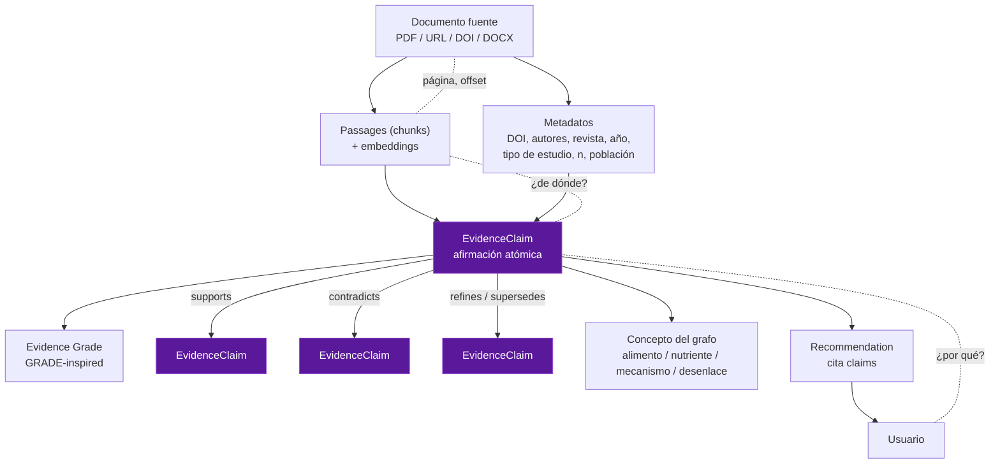
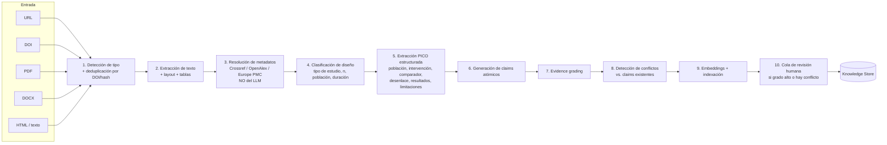
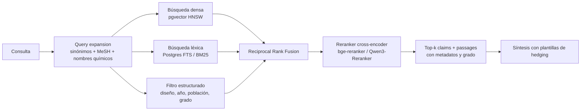
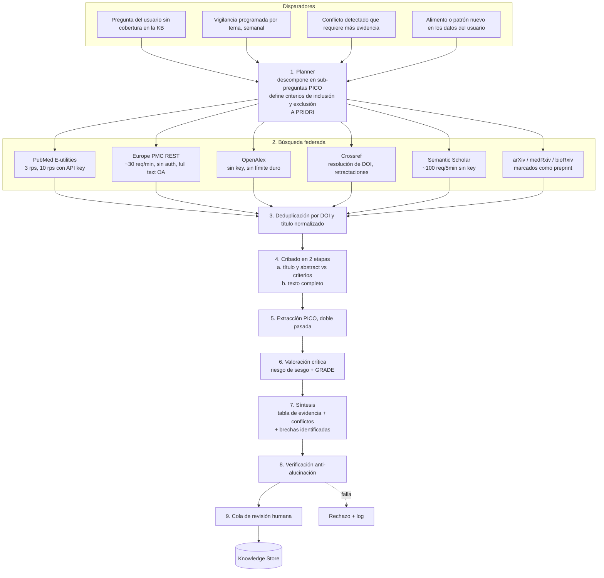

# 03 — Base de conocimiento científico, RAG y Research Agent

## 1. La idea central: el átomo de conocimiento no es el chunk, es el *claim*

Un RAG ingenuo indexa trozos de texto y los recupera por similitud. Eso **no puede** cumplir
los requisitos del brief: no puede representar que un estudio contradice a otro, no puede
versionar conocimiento, no puede eliminar conocimiento incorrecto sin dejar huérfanas las
recomendaciones que lo citaban, y no puede distinguir un ECA de un estudio en ratones.

La unidad de conocimiento aquí es el **`EvidenceClaim`**: una afirmación atómica, tipada,
graduada y trazable a los pasajes exactos que la soportan.



Esa cadena `Usuario → Recommendation → Claim → Passage → Documento(página)` es la
**trazabilidad completa** que pide el punto 5 del brief. Es navegable en ambos sentidos y no
depende de que el LLM "recuerde" la fuente.

---

## 2. Pipeline de ingesta de documentos



### Notas de implementación por etapa

**(2) Extracción**. No usar el LLM para leer PDFs desde cero. Orden de preferencia:
1. **Texto nativo** del PDF (`pymupdf`) — rápido y exacto cuando existe.
2. **Full text de Europe PMC / PMC OA** si el DOI está en acceso abierto: XML estructurado,
   infinitamente mejor que cualquier OCR.
3. **Modelo de layout** (`docling`, `marker`, o `Nougat`) para PDFs de dos columnas con
   tablas y fórmulas.
4. **OCR** (PaddleOCR / Tesseract) sólo para escaneos. El VLM como último recurso para
   figuras y tablas rebeldes.

**(3) Metadatos: nunca del LLM.** Esta es la defensa principal contra artículos inventados.
El DOI se resuelve contra **Crossref** (autoridad de registro) y se enriquece con
**OpenAlex** (tipo de obra, citas, open access) y **Europe PMC** (indexación biomédica,
tipo de publicación MeSH). Si un DOI no resuelve, **el documento no entra en la base de
conocimiento** — se queda en cuarentena. Un LLM que "recuerda" un DOI es la fuente #1 de
alucinación bibliográfica y aquí queda estructuralmente imposibilitado.

**(5) Extracción PICO** con salida forzada a esquema:

```python
class StudyExtraction(BaseModel):
    design: Literal[
        "meta_analysis",
        "systematic_review",
        "rct",
        "crossover_rct",
        "prospective_cohort",
        "case_control",
        "cross_sectional",
        "n_of_1",
        "animal",
        "in_vitro",
        "mechanistic",
        "narrative_review",
        "preprint",
        "unclear",
    ]
    population: PopulationSpec  # especie, n, edad, estado glucémico, país
    intervention: str
    comparator: str | None
    outcomes: list[OutcomeResult]  # nombre, dirección, efecto, CI, p, unidad
    duration_days: int | None
    funding_conflicts: str | None
    limitations: list[str]  # extraídas de la sección de limitaciones
    author_conclusion: str
    registration_id: str | None  # NCT..., PROSPERO...
    extraction_confidence: float
```

Un modelo pequeño-mediano de razonamiento hace esto bien si la salida está forzada por esquema.
**Doble extracción** (dos pasadas, temperatura 0, prompts distintos) y comparación:
si discrepan en `design`, `n` o dirección del efecto → cola de revisión humana.

---

## 3. Evidence grading

Adaptación pragmática de **GRADE** (4 niveles de certeza: alta / moderada / baja / muy baja;
ECAs parten de "alta", observacionales de "baja"; se sube o baja por riesgo de sesgo,
inconsistencia, evidencia indirecta, imprecisión y sesgo de publicación).

Adaptación para este dominio:

```python
BASE_GRADE = {
    "meta_analysis": 4,
    "systematic_review": 4,
    "rct": 4,
    "crossover_rct": 4,
    "prospective_cohort": 2,
    "case_control": 2,
    "cross_sectional": 1,
    "n_of_1": 2,  # alto para el individuo, bajo para generalizar
    "animal": 1,
    "in_vitro": 1,
    "mechanistic": 1,
    "narrative_review": 1,
    "preprint": None,  # -1 al grado del diseño subyacente
}

DOWNGRADE = {
    "small_n": lambda s: s.population.n < 30,
    "short_duration": lambda s: (s.duration_days or 0) < 7 and s.outcome_is_chronic,
    "indirect_population": lambda s: (
        s.population.species != "human" or not s.population.matches_user_context
    ),
    "surrogate_outcome": lambda s: s.outcomes_are_surrogate,  # p.ej. SCFA fecal, no glucemia
    "imprecision": lambda s: s.ci_crosses_null,
    "unregistered_trial": lambda s: s.design.endswith("rct") and not s.registration_id,
    "industry_funded_only": lambda s: s.funding_is_sole_industry,
    "preprint": lambda s: s.is_preprint,
}

UPGRADE = {
    "large_effect": lambda s: s.effect_size_large,
    "dose_response": lambda s: s.has_dose_response,
    "replicated_independently": lambda s: s.independent_replications >= 2,
}
```

Mapeo a **lenguaje para el usuario** (requisito literal del punto 7 del brief):

| Certeza | Frase canónica | Ejemplo de este dominio |
|---|---|---|
| **Alta (4)** | "Existe evidencia consistente de que…" | Consumir verdura y proteína antes del carbohidrato reduce el pico glucémico postprandial |
| **Moderada (3)** | "La evidencia disponible indica, con reservas, que…" | El vinagre antes de la comida atenúa la glucosa postprandial |
| **Baja (2)** | "Algunos estudios sugieren…" | Suplementación con propionato/butirato mejora sensibilidad a insulina |
| **Muy baja (1)** | "Existe una hipótesis biológicamente plausible, pero la evidencia clínica es limitada" | Vínculos entre permeabilidad intestinal y respuesta glucémica |

Las frases son **plantillas fijas**, no generadas por el LLM. El LLM elige el claim; la
plantilla de hedging la impone el código según el grado. Esto elimina la clase entera de
fallo "el modelo exageró la conclusión".

---

## 4. Conflictos, versionado y corrección

### 4.1 Representar el conflicto en lugar de sobrescribir

Cuando un claim nuevo contradice uno existente, **no se borra nada**. Se crea una arista
tipada y se recalcula el estado del *tema*:

```sql
CREATE TYPE claim_relation AS ENUM (
  'supports','contradicts','refines','supersedes',
  'replicates','fails_to_replicate','extends_to_population'
);

CREATE TABLE claim_edge (
  src_claim_id uuid, dst_claim_id uuid, relation claim_relation,
  detected_by text,            -- 'auto_nli' | 'human' | 'research_agent'
  confidence real,
  rationale text,
  created_at timestamptz,
  reviewed_by uuid NULL
);
```

Detección automática de contradicción: recuperar los k claims más similares del mismo
`(concept, outcome)` y ejecutar una comprobación de **inferencia natural (NLI)** —
implica / contradice / neutral — más una comprobación **determinista de dirección del efecto**
(signo del efecto e intervalos de confianza solapados o no). La segunda es la que manda:
si un estudio dice `-0.4 mmol/L (IC -0.6,-0.2)` y otro `+0.1 (IC -0.1,+0.3)`, eso es un
conflicto detectable sin LLM.

Estado agregado por tema, calculado (no escrito a mano):

```python
class TopicConsensus(StrEnum):
    ESTABLISHED = "consistente entre estudios de alta certeza"
    LIKELY = "mayoría concordante, con excepciones"
    CONTESTED = "estudios de calidad comparable en desacuerdo"  # <-- se muestra al usuario
    EMERGING = "sólo evidencia preliminar"
    SUPERSEDED = "reemplazado por evidencia posterior"
    INSUFFICIENT = "no hay suficiente evidencia"
```

Cuando un tema está en `CONTESTED`, el agente **debe** presentar ambos lados. No hay
mecanismo para que elija uno. Ejemplo de salida:

> "Sobre el efecto del vinagre: los metaanálisis de ensayos clínicos indican una atenuación
> significativa de la glucosa postprandial *(certeza moderada, N estudios)*. Sin embargo,
> [estudio X, 2026] no replicó el efecto en personas normoglucémicas. **El tema está en
> disputa para tu perfil concreto.** Puedo diseñarte una prueba de 8 días para ver qué pasa
> contigo."

### 4.2 Versionado del conocimiento

- Los claims son **inmutables**. Corregir = crear versión nueva + arista `supersedes` +
  marcar la anterior `retired_at`.
- Cada `Recommendation` guarda los `claim_id@version` exactos que citó → una recomendación de
  hace 6 meses es reproducible aunque el conocimiento haya cambiado.
- **Retractaciones**: chequeo periódico contra Crossref (`update-to` / `is-retracted-by`) y el
  índice de retractaciones. Un paper retractado propaga `INVALIDATED` a sus claims y **marca**
  todas las recomendaciones que los citaron. El usuario recibe una notificación de corrección.
  Esto es raro en productos comerciales y es exactamente lo que da credibilidad científica.
- **Borrado de conocimiento incorrecto**: `retire_claim(id, reason)` → tombstone + recálculo
  del consenso del tema + reindexado. Nunca `DELETE`.

### 4.3 ¿Hace falta una base de datos de grafos?

**No al principio.** El grafo tiene aproximadamente:
- 10³–10⁴ conceptos (alimentos, nutrientes, mecanismos, desenlaces, taxones microbianos)
- 10⁴–10⁵ claims
- 10⁵ aristas

Eso son dos tablas en PostgreSQL con índices, y consultas recursivas con `WITH RECURSIVE`.
Neo4j/Memgraph se justifica cuando necesites travesías de >3 saltos en ruta caliente o
razonamiento de caminos sobre >10⁶ aristas. Documenta el disparador y sigue.

### 4.4 Estrategia de recuperación (el RAG real)

RAG puramente vectorial falla en dominio científico: "vinagre" y "ácido acético" son lo mismo
semánticamente pero "no redujo" y "redujo" también lo parecen. Pipeline híbrido:



Claves:
- **Se recuperan claims, no chunks.** Los passages van adjuntos como evidencia del claim.
  Esto es lo que permite que el filtro estructurado (`design = 'rct' AND year >= 2015 AND
  population.species = 'human'`) funcione — filtrar chunks de texto por metadatos de estudio
  es imposible si el chunk no está ligado a un objeto estructurado.
- **El filtro estructurado precede al ranking semántico.** Priorizar revisiones sistemáticas
  y metaanálisis (requisito del brief) es un `ORDER BY base_grade DESC`, no una instrucción
  en el prompt.
- **Chunking consciente de secciones**: no partir a ciegas cada 512 tokens. Métodos,
  resultados y limitaciones se indexan por separado con etiqueta de sección, porque la
  pregunta "¿cuáles son las limitaciones?" debe recuperar la sección de limitaciones.

---

## 5. Research Agent

### 5.1 Por qué debe estar separado del agente conversacional

| Dimensión | Agente conversacional | Research Agent |
|---|---|---|
| Latencia | segundos | minutos–horas |
| Modo | síncrono, interactivo | batch, asíncrono |
| Datos de usuario | sí (PII de salud) | **nunca** |
| Acceso a internet | no | sí (solo APIs académicas en allowlist) |
| Escritura | ninguna | propone claims → cola de revisión |
| Fallo tolerable | degradar respuesta | reintentar, no urge |
| Modelo | rápido, tool-calling | razonamiento largo, contexto grande |

Mezclarlos crea tres problemas: latencia inaceptable en el chat, superficie de
prompt-injection sobre datos de salud, y un agente con permisos de escritura conversando
con un usuario.

### 5.2 Arquitectura



### 5.3 Las 6 defensas anti-alucinación (verificación determinista, etapa 8)

El brief pide explícitamente evitar artículos inexistentes, conclusiones exageradas,
correlación como causalidad, estudios pequeños como definitivos y estudios animales como
evidencia clínica. Cada uno tiene un control **de código**, no de prompt:

| Riesgo | Control determinista |
|---|---|
| **Artículos inexistentes** | Todo DOI se resuelve contra Crossref/OpenAlex **antes** de persistir. Título, autores y año deben coincidir por *fuzzy match* ≥ 0.9 con el registro. Sin resolución → cuarentena. **El LLM nunca escribe metadatos bibliográficos.** |
| **Cita que no dice lo que se afirma** | Cada claim exige `supporting_passage_id` + offsets de carácter. Verificador: comprobar que el pasaje existe literalmente en el documento (`substring match`) y que un NLI cross-encoder da `entailment` entre pasaje y claim. Si no → rechazo. |
| **Conclusiones exageradas** | Plantillas de hedging fijadas por grado (§3). El LLM no elige el nivel de certeza; lo calcula el `evidence_grader`. Detector léxico de sobre-afirmación ("demuestra", "prueba", "cura", "elimina") como bloqueo duro. |
| **Correlación → causalidad** | El campo `design` es obligatorio. Si `design ∈ {cross_sectional, cohort, case_control}`, el renderizador **fuerza** verbos asociativos ("se asocia con") y prohíbe causales ("reduce", "provoca"). Regla, no sugerencia. |
| **Estudios pequeños como definitivos** | `n` es obligatorio y se muestra siempre. `n < 30` → downgrade automático y prefijo obligatorio "en un estudio pequeño (n=…)". Un solo estudio nunca produce grado 4. |
| **Estudios animales como evidencia clínica** | `population.species != "human"` fuerza `evidence_class = MECHANISTIC_ONLY`. Los claims mecanísticos están **prohibidos** como base de una recomendación al usuario: sólo pueden aparecer como *explicación* de un claim clínico que ya exista. Frontera dura en el Recommendation Engine. |

Defensa adicional, la más importante: **el Research Agent no tiene permiso de escritura en la
KB.** Escribe en `claim_candidate`. La promoción a `claim` requiere que el verificador
determinista pase **y** (para grado ≥ 3, o si hay conflicto) revisión humana. Con un equipo
pequeño esto es unos minutos por semana, y es lo que separa un sistema científico de un
generador de plausibilidad.

### 5.4 Ejemplo trazado: "¿el vinagre antes de comer reduce la respuesta glucémica?"

1. **Planner** → PICO: P = adultos, I = vinagre/ácido acético pre-comida (5–30 mL),
   C = placebo/sin vinagre, O = glucosa postprandial (iAUC, pico).
   Inclusión: humanos, ensayo controlado, ≥ 2010 o incluido en SR. Exclusión: animales, in vitro.
2. **Búsqueda** → Europe PMC + PubMed con términos MeSH `Acetic Acid`, `Postprandial Period`,
   `Blood Glucose`, filtro `publication_type: Meta-Analysis OR Systematic Review` primero.
3. **Hallazgos priorizados** → metaanálisis de ensayos clínicos sobre vinagre y respuesta
   postprandial (Shishehbor et al., *Diabetes Res Clin Pract* 2017); SR+metaanálisis
   dosis-respuesta con evaluación GRADE sobre vinagre de manzana en T2D (2025); SR sobre
   vinagre y control glucémico en T2D (2019).
4. **Grading** → metaanálisis de ECAs = base 4; downgrade por heterogeneidad y n pequeños en
   estudios individuales → **certeza moderada**.
5. **Claim generado** →
   `"El consumo de vinagre (≈10–20 mL) antes de una comida rica en almidón se asocia con
   reducción de la glucosa e insulina postprandiales en adultos; mecanismo propuesto: retraso
   del vaciamiento gástrico."` grade=3, design=meta_analysis, population=human.
6. **Conflictos** → busca claims contradictorios; ninguno de certeza comparable → `LIKELY`.
7. **Salida al usuario** → plantilla de certeza moderada + **oferta de experimento N-of-1**,
   porque el sistema no sabe si *este* usuario responde.

---

## 6. Microbiota intestinal: cómo incorporarla sin caer en pseudociencia

Este es el capítulo con mayor riesgo reputacional del proyecto. La estrategia es
**estructural, no de tono**.

### 6.1 Estado real de la evidencia (verificado)

- Zeevi et al. (*Cell*, 2015, n=800) mostraron que rasgos personales **y del microbioma**
  mejoran la predicción de la respuesta glucémica postprandial frente a métodos estándar,
  y que intervenciones dietéticas personalizadas cortas redujeron la glucemia post-comida.
  Fuerte, pero es **predicción**, no mecanismo causal por taxón.
- Análisis de **randomización mendeliana** sugieren que aumentos de butirato de origen
  genético se asocian a mejor respuesta insulínica y que alteraciones en producción/absorción
  de propionato se relacionan causalmente con mayor riesgo de T2D. Es de las mejores
  evidencias causales disponibles — y sigue siendo indirecta.
- Una **revisión sistemática de 2025** sobre AGCC fecales y trastornos metabólicos incluyó
  sólo **7 estudios**, con riesgo de sesgo moderado por muestras pequeñas y heterogeneidad de
  métodos de medición, sin puntos de corte estandarizados, y con confusión por dieta,
  medicación y hábito intestinal. Conclusión de los autores: se requieren estudios
  longitudinales estandarizados más grandes.

**Traducción**: la dimensión microbiota es, hoy, mayoritariamente **grado 1–2**. Un sistema
honesto lo refleja en su arquitectura.

### 6.2 Controles arquitectónicos

1. **Namespace con política propia.** Los claims de microbiota viven en el mismo store pero
   con `domain = 'microbiome'` y una política de grading **más estricta**: el techo por defecto
   es certeza 2 (baja) salvo metaanálisis de ECAs en humanos con desenlace clínico.
2. **Distinción obligatoria desenlace subrogado vs. clínico.** "Aumenta AGCC fecales" es un
   **subrogado**. No puede sustentar por sí solo una recomendación. El campo
   `outcome_type ∈ {clinical, surrogate, mechanistic}` es obligatorio y el Recommendation
   Engine rechaza claims `surrogate`/`mechanistic` como justificación primaria.
3. **Prohibición de personalización microbiómica sin datos.** El sistema **no** afirma nada
   sobre *tu* microbiota a menos que exista una `MicrobiomeObservation` real (secuenciación
   16S/shotgun subida por el usuario). Sin datos, sólo puede hablar de **fibra y sustratos
   fermentables** — que es donde la evidencia dietética es sólida — nunca de taxones.
4. **Lista negra de afirmaciones.** Regla determinista que bloquea el vocabulario
   pseudocientífico: "desintoxicar", "equilibrar tu flora", "curar el intestino permeable",
   "reset del microbioma", asignación a "tipos" de microbioma. Bloqueo a nivel de guardrail
   de salida, no de prompt.
5. **Uso legítimo y acotado**: la microbiota entra como **explicación mecanística** de un
   patrón ya observado en los datos del usuario, nunca como origen de una recomendación.
   Ejemplo permitido:
   > "Tus 11 comidas con ≥ 8 g de fibra muestran un iAUC ~24% menor (IC 95%: 6–40%)
   > *(evidencia personal, grado B)*. Una explicación biológicamente plausible es la
   > fermentación colónica de fibra a ácidos grasos de cadena corta *(hipótesis mecanística,
   > certeza baja — la evidencia clínica en humanos es limitada y heterogénea)*."

   Ejemplo prohibido, aunque el usuario lo pida:
   > ~~"Tu microbiota necesita más Akkermansia, come X."~~

6. **Si el usuario sube un test comercial de microbioma**: se almacena como observación con
   fuerte advertencia sobre la falta de estandarización entre laboratorios, y **no** alimenta
   el modelo predictivo hasta Fase 4+. Se usa como contexto descriptivo.

---

## 7. Qué guarda cada componente de la capa de conocimiento

| Contenido | Almacén | Motivo |
|---|---|---|
| Metadatos del documento, claims, aristas, grados, versiones | PostgreSQL (relacional) | Es un problema relacional con integridad referencial; el "grafo" son 2 tablas |
| Passages + embeddings | PostgreSQL + `pgvector` (HNSW) | Un solo store, transacciones ACID con los claims, joins con filtros estructurados |
| PDFs, HTML archivado, figuras | Object storage (S3/MinIO) | Binarios; hash de contenido como clave |
| Índice léxico | PostgreSQL FTS (`tsvector`) | Suficiente para 10⁵–10⁶ chunks; evita añadir OpenSearch |
| Caché de respuestas de APIs académicas | PostgreSQL + TTL | Respetar rate limits (Europe PMC ~30 req/min, NCBI 3–10 rps) |

**No se necesita Qdrant, ni Neo4j, ni Elasticsearch en las fases 1–3.** Se necesitan cuando
crucen los umbrales de [01-arquitectura.md §9.2](01-arquitectura.md).
