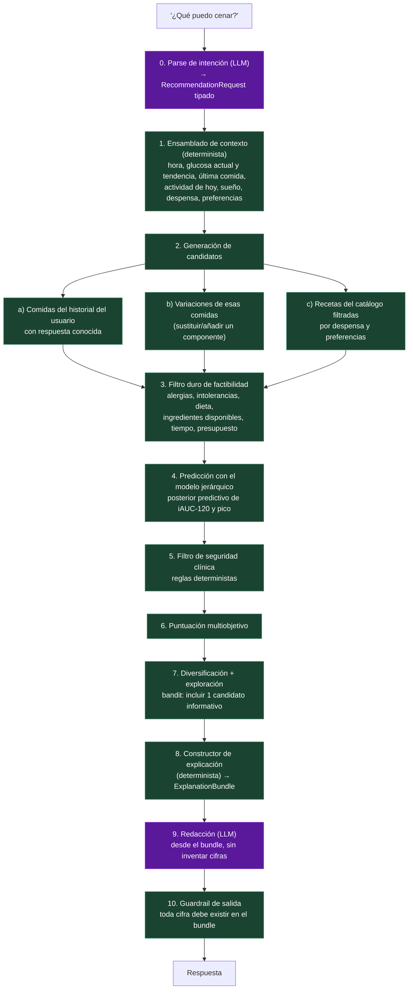

# 04 — Recommendation Engine y explicabilidad

## 1. El Recommendation Engine no es un LLM

"¿Qué puedo cenar?" parece una pregunta de lenguaje, pero la respuesta correcta requiere:
generar candidatos factibles, predecir su efecto con incertidumbre, filtrar por seguridad y
optimizar múltiples objetivos en conflicto. Nada de eso lo hace bien un LLM y todo es
auditable si se hace determinista.

**El LLM entra sólo dos veces**: al principio (parsear la intención y el contexto en un objeto
tipado) y al final (redactar la explicación a partir de un objeto tipado). En medio, código.



---

## 2. Predicción: usar el posterior predictivo, no una media puntual

Para cada candidato se obtiene una **distribución**, no un número:

```python
class MealPrediction(BaseModel):
    candidate_id: str
    iauc120_median: float
    iauc120_hdi95: tuple[float, float]
    peak_delta_median: float
    peak_delta_hdi95: tuple[float, float]
    p_peak_exceeds_user_threshold: float  # p.ej. P(pico > basal + 50)
    evidence_basis: Literal[
        "personal_replicated",  # A: has comido esto, en ensayo N-of-1
        "personal_observational",  # B: has comido esto varias veces
        "personal_analogous",  # el modelo interpola desde comidas similares tuyas
        "population_prior",  # sin datos tuyos: prior poblacional + macros
    ]
    n_personal_exposures: int
    uncertainty_driver: str  # "pocas exposiciones" | "porción incierta" | "hora atípica"
```

`evidence_basis` es la salida directa del *partial pooling*: no es una etiqueta añadida a mano,
sino una lectura de cuánto pesó el nivel individual frente al poblacional en el posterior.
Se muestra siempre al usuario.

---

## 3. Puntuación multiobjetivo

Un solo objetivo ("minimizar el pico") produce recomendaciones absurdas: pechuga de pollo
hervida, todos los días. Objetivos reales, con pesos configurables por el usuario:

```python
score = (
    w_glyc * glycemic_utility  # normalizado, decreciente en iAUC predicho
    + w_pref * preference_match  # historial de aceptación, gustos declarados
    + w_nutr * nutritional_adequacy  # proteína, fibra, micronutrientes, variedad
    + w_feas * feasibility  # despensa, tiempo, costo, esfuerzo
    + w_var * dietary_variety  # penaliza repetir lo de los últimos 3 días
    + w_info * information_gain  # valor experimental: reduce incertidumbre
    - w_risk * prediction_risk  # penaliza incertidumbre alta (aversión al riesgo)
)
```

Dos términos merecen defensa:

**`information_gain`** — el sistema debería a veces recomendar algo cuyo efecto **no** conoce,
precisamente para aprenderlo. Es un problema de bandit contextual clásico (explotación vs.
exploración). Sin este término, el sistema converge a 5 comidas y deja de aprender.
Implementación: reducción esperada de entropía del posterior de `theta_food[u,f]`. Se presenta
con honestidad: *"esta es una sugerencia exploratoria — no sé cómo te afecta y quiero medirlo"*.

**`dietary_variety`** — restricción de seguridad, no de placer. Un motor que optimiza sólo
glucemia converge a dietas nutricionalmente pobres, y un sistema que empuja hacia la
restricción alimentaria en un usuario vulnerable puede reforzar conductas alimentarias
desordenadas. Ver §5.

---

## 4. El ExplanationBundle: explicabilidad por construcción

El LLM **no** genera la explicación; la **redacta** desde una estructura ya completa. Si un
número no está en el bundle, no puede aparecer en el texto.

```python
class ExplanationBundle(BaseModel):
    recommendation_id: UUID
    candidate: MealCandidate
    prediction: MealPrediction

    personal_evidence: list[PersonalEvidenceItem]
    # "9 veces con frijol+aguacate: iAUC mediano 3,120 (IC 2,400-4,050)"
    #  cada item con: n, estadístico, IC, grado, link a las comidas concretas

    scientific_evidence: list[ScientificEvidenceItem]
    # cada item: claim_id@version, frase con plantilla de hedging según grado,
    #            diseño, n, población, DOI, y si el tema está CONTESTED

    contextual_factors: list[str]
    # "es de noche y tu respuesta nocturna tiende a ser mayor (grado B, n=14)"

    counterfactual: CounterfactualItem | None
    # "si cambiaras el arroz por frijol, la predicción bajaría ~28% (IC 9-44%)"

    uncertainty_statement: str
    # obligatorio, generado por plantilla desde evidence_basis + n

    what_i_dont_know: list[str]
    # obligatorio y no vacío. "no tengo datos tuyos de cena a esta hora"
    # "no puedo separar el efecto del aguacate del de la hora"

    caveats: list[str]  # disclaimers médicos aplicables
    citations: list[Citation]  # trazabilidad completa
```

**`what_i_dont_know` no puede estar vacío.** Es una invariante del sistema verificada en tests.
Es la característica más importante para la confianza a largo plazo y la que ningún producto
comercial del sector tiene.

### Ejemplo de salida completa

> **Te sugiero: pechuga de pollo a la plancha con frijoles de la olla, ensalada de nopal y
> media palta, con 1 tortilla de maíz.**
>
> **Por qué (tus datos):**
> - Has comido una combinación muy parecida **7 veces**. iAUC-120 mediano **2,980 mg/dL·min**
>   (IC 95%: 2,300–3,900), Δ pico mediano **+34 mg/dL**. Está en tu **percentil 24** — de tus
>   comidas más planas. *(Grado B — asociación personal observacional, n=7)*
> - Tus cenas con **≥ 8 g de fibra** muestran un iAUC ~24% menor que las de < 4 g
>   (IC 95%: 6–40%, n=11 vs 9). *(Grado B)*
>
> **Por qué (evidencia científica):**
> - Existe evidencia consistente de que consumir verdura y proteína antes del carbohidrato
>   reduce el pico glucémico postprandial y la variabilidad hasta 3 h en personas con
>   diabetes tipo 2. *(Certeza alta — ensayos cruzados; Diabetes Care 2015, 2025)*
>   → **Sugerencia de orden: nopal y pollo primero, tortilla al final.**
>
> **Lo que no sé:**
> - No tengo datos tuyos de esta combinación **después de las 21:00** — sólo entre 19:00 y
>   20:30. Tu respuesta podría ser distinta.
> - Las 7 ocasiones fueron todas en días **sin ejercicio vespertino**, así que no puedo
>   decirte cómo interactúa con tu caminata.
> - La porción de palta la estimé de tu foto (**±35%**); si la mides, la predicción mejora.
>
> **Alternativa exploratoria:** si quieres que aprenda más, prueba la misma cena con
> **quinoa en lugar de tortilla**. No tengo datos tuyos de quinoa y es la incógnita que más
> reduciría mi incertidumbre esta semana.
>
> *Esto es información de bienestar general basada en tus registros. No sustituye
> asesoramiento médico ni nutricional profesional.*

---

## 5. Filtros de seguridad (deterministas, previos a la puntuación)

Reglas duras, no negociables por el modelo:

```python
HARD_FILTERS = [
    "alergias e intolerancias declaradas",
    "restricciones dietéticas (religiosas, éticas, médicas declaradas)",
    "energía diaria mínima: bloquear si el plan del día cae por debajo de un umbral seguro",
    "no recomendar ayuno prolongado, dietas <1200 kcal, ni eliminación de grupos alimentarios",
    "no recomendar cambios si el usuario reporta uso de insulina o sulfonilureas "
    "sin advertencia explícita de riesgo de hipoglucemia y derivación a su médico",
    "no recomendar en absoluto si hay señales de riesgo (ver abajo)",
]

ESCALATION_TRIGGERS = [
    "glucosa < 70 mg/dL registrada",  # → protocolo de hipoglucemia + médico
    "glucosa > 250 mg/dL sostenida",  # → médico
    "patrón de restricción alimentaria progresiva",  # → posible TCA
    "lenguaje del usuario sugestivo de trastorno alimentario",
    "pérdida de peso rápida no intencionada",
    "síntomas reportados: sed extrema, poliuria, visión borrosa, pérdida de peso",
]
```

Sobre el riesgo de **trastornos de la conducta alimentaria**: es el riesgo psicológico
específico de este producto. Un sistema que rankea alimentos como "buenos/malos" y muestra
curvas a un usuario ansioso puede hacer daño real. Mitigaciones de producto, no sólo de texto:
lenguaje siempre neutro (nunca "malo", "culpa", "castigo"), no mostrar un score global diario
tipo "calificación", detección de patrones de restricción, y opción de modo "sin números".

---

## 6. Ponderación entre evidencia general y evidencia personal

Punto 13 del brief. La respuesta corta: **no se pondera con una fórmula ad hoc; se resuelve
dentro del modelo bayesiano.** Pero conviene explicitar el comportamiento resultante:

| Situación | Qué domina | Qué dice el sistema |
|---|---|---|
| n = 0 exposiciones personales | Prior poblacional + macros | "Basado en la composición y en cómo responden personas con un perfil similar al tuyo — **no en tus datos**" |
| n = 1–3 | Prior poblacional, muy encogido | "Lo has comido 2 veces con respuestas de +38 y +71 mg/dL. **Demasiada variación para concluir nada.**" |
| n = 4–7 | Mezcla; incertidumbre visible | "Tendencia hacia X, pero el intervalo sigue siendo amplio" |
| n ≥ 8, HDI excluye ROPE | Evidencia personal | "En tus datos, de forma consistente…" *(Grado B)* |
| N-of-1 aleatorizado completado | Evidencia personal causal | "Lo probamos de forma controlada: …" *(Grado A)* |
| Personal contradice a la ciencia poblacional | **Personal**, con la contradicción explícita | "La evidencia general indica que la avena tiene respuesta moderada, pero **en tus 11 registros está en tu percentil 90**. Los individuos varían; tus datos pesan más para ti." |

Ese último caso es el corazón del producto y hay que manejarlo con cuidado: es exactamente lo
que Zeevi et al. demostraron (la variabilidad interpersonal es real), y **es también** donde
más fácil es confundir ruido con señal, dado el ICC bajo. Por eso el umbral n≥8 y la ROPE
son innegociables.
