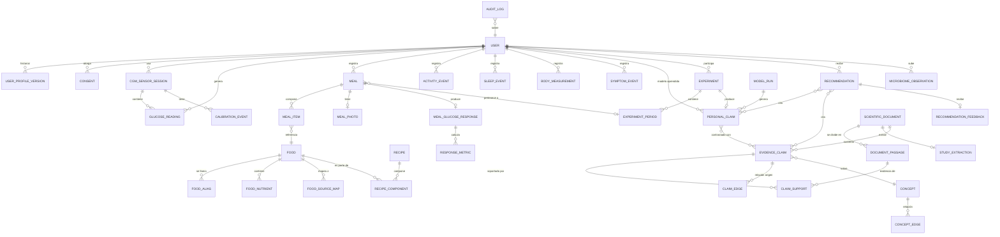

# 05 — Modelo de datos

## 1. Principio: un solo PostgreSQL hasta que duela

La pregunta del brief — "¿realmente necesitamos todos esos componentes?" — tiene una respuesta
clara: **no**.

Aritmética: un CGM a 5 min = **288 lecturas/día/usuario** = ~105,000 filas/año/usuario.
Con 100 usuarios eso son ~10.5M filas/año. PostgreSQL con un índice BRIN sobre el timestamp
maneja eso sin despeinarse. El corpus científico serán 10⁴–10⁶ chunks, muy por debajo del
límite práctico de `pgvector` (~50–100M vectores con HNSW).

| Componente | ¿En Fase 1? | Disparador para adoptarlo |
|---|---|---|
| PostgreSQL | ✅ Obligatorio | — |
| `pgvector` (extensión) | ✅ | — |
| Object storage (MinIO/S3) | ✅ | Fotos y PDFs no van en la DB |
| TimescaleDB (extensión) | ⏳ Opcional | > ~50–100M filas de glucosa, o batch nocturno > 2h. **Es una extensión de Postgres**: adoptarla después es `create_hypertable()`, no una migración |
| Vector DB dedicada (Qdrant) | ❌ | > 50M vectores o necesidad de BM25 nativo / multi-tenant duro |
| Graph DB (Neo4j) | ❌ | Travesías > 3 saltos en caliente o > 10⁶ aristas |
| Message broker (NATS/Kafka) | ❌ | Replay de eventos para auditoría, o múltiples consumidores independientes |
| Data warehouse | ❌ | Fase 5. Antes: DuckDB sobre Parquet exportado |

---

## 2. Diagrama entidad-relación



---

## 3. Tablas núcleo (DDL abreviado, decisiones anotadas)

### 3.1 Series de glucosa

```sql
CREATE TABLE cgm_sensor_session (
  id                uuid PRIMARY KEY,
  user_id           uuid NOT NULL REFERENCES app_user,
  vendor            text NOT NULL,        -- 'dexcom' | 'abbott' | 'other'
  model             text NOT NULL,        -- 'g7' | 'libre3' | 'libre3_plus' | ...
  device_hash       text NOT NULL,        -- hash del serial, nunca el serial
  started_at        timestamptz NOT NULL,
  ended_at          timestamptz,
  warmup_until      timestamptz NOT NULL, -- started_at + 12h: frontera de exclusión
  native_resolution_min int NOT NULL,     -- 1 | 5 | 15
  notes             text
);

CREATE TABLE glucose_reading (
  user_id           uuid NOT NULL,
  ts_utc            timestamptz NOT NULL,   -- SIEMPRE systemTime, nunca displayTime
  tz_offset_min     smallint NOT NULL,      -- para análisis por hora local
  value_mgdl        real NOT NULL,
  session_id        uuid NOT NULL REFERENCES cgm_sensor_session,
  trend             smallint,
  quality_flags     int NOT NULL DEFAULT 0, -- bitmask, ver abajo
  ingest_batch_id   uuid NOT NULL,
  PRIMARY KEY (user_id, ts_utc, session_id)
);
CREATE INDEX ON glucose_reading USING BRIN (ts_utc);   -- BRIN: perfecto para series temporales
```

`quality_flags` como bitmask, no booleanos sueltos:

```
1   OUT_OF_PHYSIOLOGICAL_RANGE   (<40 o >400)
2   IMPLAUSIBLE_RATE             (|dG/dt| > 6 mg/dL/min sostenido)
4   IN_SENSOR_WARMUP             (< 12h desde started_at)
8   SUSPECTED_COMPRESSION_LOW
16  POST_GAP_INTERPOLATED
32  SENSOR_TRANSITION_STEP
64  CALIBRATION_ADJACENT
```

Se **marca, no se borra**. La regla de exclusión vive en la consulta, no en la ingesta —
así se puede cambiar la política sin reimportar datos.

### 3.2 Comidas y composición

```sql
CREATE TABLE meal (
  id                uuid PRIMARY KEY,
  user_id           uuid NOT NULL,
  consumed_at       timestamptz NOT NULL,
  tz_offset_min     smallint NOT NULL,
  meal_type         text,                    -- desayuno | comida | cena | colación
  eating_duration_min smallint,
  order_pattern     text,                    -- 'carbs_last' | 'carbs_first' | 'mixed' | 'unknown'
  free_text         text,
  photo_id          uuid REFERENCES meal_photo,
  entry_completeness real,                   -- 0..1, calculado; entra en la verosimilitud
  experiment_period_id uuid,
  created_at        timestamptz NOT NULL
);

CREATE TABLE meal_item (
  id                uuid PRIMARY KEY,
  meal_id           uuid NOT NULL REFERENCES meal ON DELETE CASCADE,
  food_id           uuid REFERENCES food,
  raw_label         text NOT NULL,           -- lo que dijo el VLM o el usuario
  quantity_value    real,
  quantity_unit     text,                    -- 'g' | 'ml' | 'pieza' | 'taza' | 'equivalente_SMAE'
  quantity_low      real,                    -- rango de incertidumbre
  quantity_high     real,
  preparation       text,                    -- 'frito' | 'hervido' | 'asado' | 'crudo'
  provenance        provenance_enum NOT NULL,
  vlm_confidence    real,
  bbox              jsonb,
  user_corrected    boolean NOT NULL DEFAULT false
);
```

`user_corrected` es doblemente valioso: mejora el dato **y** alimenta el eval del VLM
(`vision_correction_rate`).

### 3.3 La tabla central del producto

```sql
CREATE TABLE meal_glucose_response (
  id                  uuid PRIMARY KEY,
  meal_id             uuid NOT NULL UNIQUE REFERENCES meal,
  user_id             uuid NOT NULL,
  session_id          uuid NOT NULL,

  baseline_mgdl       real NOT NULL,        -- mediana de [-20,-5] min
  baseline_sd         real,
  peak_mgdl           real,
  peak_delta_mgdl     real,
  time_to_peak_min    smallint,
  iauc_120            real,
  iauc_180            real,
  auc_total_120       real,
  time_above_baseline_min      smallint,
  time_to_return_baseline_min  smallint,
  curve_shape         text,                 -- 'monophasic' | 'biphasic' | 'plateau' | 'flat'

  coverage_pct        real NOT NULL,
  max_gap_min         smallint NOT NULL,
  quality             response_quality NOT NULL,  -- 'ok' | 'degraded' | 'excluded'
  exclusion_reasons   text[] NOT NULL DEFAULT '{}',

  -- covariables congeladas al momento del cálculo (reproducibilidad)
  hour_local          smallint NOT NULL,
  prev_meal_gap_min   int,
  activity_prev_2h_kcal real,
  sleep_debt_min      int,
  vendor              text NOT NULL,

  algorithm_version   text NOT NULL,        -- 'metrics@2.1.0' — imprescindible
  computed_at         timestamptz NOT NULL
);
```

`algorithm_version` no es opcional. Cuando cambies la definición de baseline o la regla de
exclusión, necesitas poder recalcular y comparar. Sin esto, el histórico es inauditable.

### 3.4 Claims personales y científicos (el mismo patrón)

```sql
CREATE TABLE personal_claim (
  id              uuid PRIMARY KEY,
  user_id         uuid NOT NULL,
  version         int NOT NULL,
  subject_type    text NOT NULL,     -- 'food' | 'food_combo' | 'timing' | 'order' | 'context'
  subject_ref     jsonb NOT NULL,
  statement       text NOT NULL,     -- generado por plantilla, no por LLM libre
  metric          text NOT NULL,     -- 'iauc_120'
  posterior_mean  real, hdi_low real, hdi_high real,
  n_exposures     int NOT NULL,
  evidence_grade  text NOT NULL,     -- A_PERSONAL_REPLICATED | B_... | C_... | D_...
  rope_excluded   boolean NOT NULL,
  confounders_checked text[] NOT NULL,
  confounders_unresolved text[] NOT NULL,
  model_run_id    uuid NOT NULL REFERENCES model_run,
  supersedes_id   uuid REFERENCES personal_claim,
  status          text NOT NULL,     -- 'active' | 'superseded' | 'retired'
  created_at      timestamptz NOT NULL,
  retired_at      timestamptz
);

CREATE TABLE evidence_claim (
  id              uuid PRIMARY KEY,
  version         int NOT NULL,
  domain          text NOT NULL,     -- 'glycemia' | 'microbiome' | 'nutrition' | 'activity'
  statement       text NOT NULL,
  concept_ids     uuid[] NOT NULL,
  design          text NOT NULL,
  population      jsonb NOT NULL,    -- species, n, edad, estado glucémico
  outcome_type    text NOT NULL,     -- 'clinical' | 'surrogate' | 'mechanistic'
  effect_direction text,             -- 'increase' | 'decrease' | 'null' | 'mixed'
  effect_size     jsonb,             -- valor, unidad, IC
  certainty       smallint NOT NULL, -- 1..4 (GRADE-inspired)
  certainty_rationale jsonb NOT NULL,-- qué subió/bajó el grado y por qué
  document_id     uuid NOT NULL REFERENCES scientific_document,
  status          text NOT NULL,     -- 'active'|'superseded'|'retired'|'invalidated_retraction'
  supersedes_id   uuid REFERENCES evidence_claim,
  reviewed_by     uuid, reviewed_at timestamptz,
  created_at      timestamptz NOT NULL
);

CREATE TABLE claim_support (          -- trazabilidad al pasaje exacto
  claim_id      uuid NOT NULL REFERENCES evidence_claim,
  passage_id    uuid NOT NULL REFERENCES document_passage,
  char_start    int NOT NULL,
  char_end      int NOT NULL,
  nli_label     text NOT NULL,        -- 'entailment' verificado
  nli_score     real NOT NULL
);
```

### 3.5 Documento científico y grafo

```sql
CREATE TABLE scientific_document (
  id            uuid PRIMARY KEY,
  doi           text UNIQUE,
  pmid          text, pmcid text, openalex_id text, arxiv_id text,
  title         text NOT NULL,
  authors       jsonb NOT NULL,
  journal       text, year smallint,
  publication_types text[],           -- de MeSH/Crossref, no del LLM
  is_preprint   boolean NOT NULL,
  is_retracted  boolean NOT NULL DEFAULT false,
  retraction_checked_at timestamptz,
  open_access   boolean,
  source_url    text,
  object_key    text,                 -- ruta en S3/MinIO
  content_hash  text NOT NULL,        -- deduplicación
  metadata_source text NOT NULL,      -- 'crossref' | 'openalex' | 'europepmc'
  ingested_at   timestamptz NOT NULL,
  ingested_by   text NOT NULL         -- 'user_upload' | 'research_agent'
);

CREATE TABLE document_passage (
  id            uuid PRIMARY KEY,
  document_id   uuid NOT NULL REFERENCES scientific_document ON DELETE CASCADE,
  section       text,                 -- 'abstract'|'methods'|'results'|'limitations'|'discussion'
  page          smallint,
  ordinal       int NOT NULL,
  text          text NOT NULL,
  embedding     vector(1024),
  tsv           tsvector GENERATED ALWAYS AS (to_tsvector('spanish', text)) STORED
);
CREATE INDEX ON document_passage USING hnsw (embedding vector_cosine_ops);
CREATE INDEX ON document_passage USING gin (tsv);

-- El "knowledge graph": dos tablas.
CREATE TABLE concept (
  id uuid PRIMARY KEY, kind text NOT NULL,  -- food|nutrient|mechanism|outcome|taxon|condition
  canonical_name text NOT NULL, external_ids jsonb  -- MeSH, NCBI Taxonomy, FDC, SNOMED
);
CREATE TABLE concept_edge (
  src uuid, dst uuid, relation text, weight real, source_claim_id uuid
);
```

### 3.6 Experimentos, recomendaciones, auditoría

```sql
CREATE TABLE experiment (
  id uuid PRIMARY KEY, user_id uuid NOT NULL,
  hypothesis text NOT NULL, spec jsonb NOT NULL,
  status text NOT NULL,                -- proposed|accepted|running|completed|abandoned
  randomization_seed bigint NOT NULL,  -- reproducibilidad de la aleatorización
  started_at timestamptz, completed_at timestamptz,
  result_claim_id uuid REFERENCES personal_claim
);

CREATE TABLE recommendation (
  id uuid PRIMARY KEY, user_id uuid NOT NULL, created_at timestamptz NOT NULL,
  request_context jsonb NOT NULL,
  candidate jsonb NOT NULL,
  prediction jsonb NOT NULL,
  explanation_bundle jsonb NOT NULL,        -- congelado
  cited_personal_claims uuid[] NOT NULL,    -- con versión
  cited_evidence_claims uuid[] NOT NULL,
  model_versions jsonb NOT NULL,            -- {llm, vlm, bayes, metrics}
  outcome_meal_id uuid                      -- ¿la siguió? cerrar el bucle
);

CREATE TABLE audit_log (                    -- append-only, requisito legal
  id bigserial PRIMARY KEY, ts timestamptz NOT NULL,
  actor_type text NOT NULL,                 -- 'user'|'system'|'agent'|'admin'
  actor_id uuid, user_id uuid,
  action text NOT NULL, resource text NOT NULL, resource_ids uuid[],
  purpose text, ip_hash text, request_id uuid
);
```

---

## 4. Qué vive dónde — tabla de decisión

| Dato | Almacén | Por qué |
|---|---|---|
| Usuarios, perfiles, consentimientos | PostgreSQL | Integridad referencial, RLS |
| Lecturas de glucosa | PostgreSQL (+ hypertable cuando toque) | 105k filas/año/usuario; BRIN basta al principio |
| Comidas, items, respuestas, métricas | PostgreSQL | Relacional puro, joins constantes |
| Claims personales y científicos + aristas | PostgreSQL | "El grafo" son 2 tablas; `WITH RECURSIVE` para travesías |
| Passages + embeddings | PostgreSQL + `pgvector` HNSW | Transacción única con los claims; filtros estructurados en el mismo `WHERE` |
| Índice léxico | PostgreSQL FTS | Evita añadir OpenSearch |
| **Fotos de comida, PDFs, HTML archivado** | **Object storage** | Nunca binarios en la DB |
| **Artefactos de modelo** (traces MCMC, posteriores) | **Object storage** + puntero en `model_run` | Pueden ser cientos de MB |
| Exportaciones analíticas para el refit | Parquet en object storage, leído con DuckDB/Polars | Evita martillar la OLTP en el batch nocturno |
| Trazas de LLM | Langfuse (su propio Postgres) | Aislado del dominio |
| Métricas / logs | Prometheus / Loki | No en la DB de negocio |

---

## 5. Consideraciones operativas

- **Row-Level Security activada desde el día 1** en toda tabla con `user_id`. Retrofitear RLS
  en un esquema maduro es doloroso.
- **Particionado**: `glucose_reading` por rango mensual desde el principio (o hypertable).
  Barato ahora, caro después.
- **Retención**: la glucosa cruda se conserva íntegra (es el activo); las trazas de LLM 90 días;
  los logs de auditoría según el plazo legal aplicable.
- **Migraciones**: Alembic, con migraciones de datos separadas de las de esquema.
- **Export del usuario**: `GET /v1/me/export` → ZIP con todo en CSV+JSON. Es requisito de
  portabilidad (LFPDPPP/GDPR) **y** una excelente función de producto para un público técnico.
- **`algorithm_version` y `model_versions` en todas las tablas derivadas.** Es la diferencia
  entre poder responder "¿por qué el sistema dijo esto en marzo?" y no poder.
