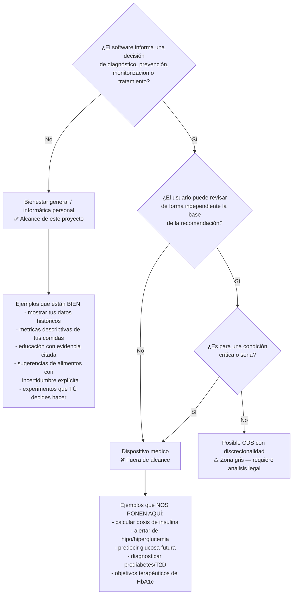

# 08 — Límites médicos, privacidad y regulación

> ⚠️ Esto es análisis técnico de arquitectura, **no asesoría legal**. Antes de operar con
> usuarios reales fuera de tu círculo, consulta a un abogado especializado en protección de
> datos y regulación sanitaria en México.

---

## 1. El límite que define el proyecto

Hay **una** decisión que determina si esto es un producto de bienestar que puedes construir
solo, o un dispositivo médico que requiere años y capital:



**La regla operativa del proyecto: nunca cruzar de `W` a `MD`.** Cualquier función que se
acerque a la frontera requiere decisión explícita documentada, no deriva de producto.

La trampa más peligrosa y más fácil de caer: **estimar carbohidratos de una foto**. Es
inofensivo como información nutricional; en el momento en que un usuario con diabetes tipo 1
lo usa para dosificar insulina, estás en territorio de dispositivo médico de riesgo alto —
y con **MAPE de ~36%** en la estimación visual, con riesgo clínico real. Mitigación
arquitectónica, no sólo textual:

- No mostrar nunca "ratio insulina/carbohidrato" ni nada que se le parezca.
- Detección de intención en el chat: si el usuario pregunta por dosis → derivación inmediata,
  sin respuesta parcial.
- Los carbohidratos se muestran **siempre como rango** con la advertencia de precisión.
- Onboarding: si el usuario declara uso de insulina, banner permanente de que las estimaciones
  no sirven para dosificar.

---

## 2. Qué puede y qué no puede hacer el sistema

### ✅ Puede

| Función | Encuadre |
|---|---|
| Mostrar los datos propios del usuario y estadísticas descriptivas | Es *su* dato |
| Calcular métricas de respuesta a comidas con incertidumbre | Informática personal |
| Identificar patrones personales con grado de evidencia | Descriptivo, no diagnóstico |
| Sugerir alimentos y combinaciones | Bienestar general |
| Sugerir el orden de ingesta | Hábito de estilo de vida con respaldo |
| Explicar evidencia científica con citas y grado | Educativo |
| Proponer experimentos N-of-1 que el usuario decide realizar | El usuario es el agente |
| Recordar registrar comidas | Utilidad |
| Exportar todo para llevarlo a un profesional | **Alto valor y bajo riesgo** |

### ❌ No debe

| Función | Por qué |
|---|---|
| Calcular o sugerir dosis de insulina o de cualquier fármaco | Dispositivo médico de alto riesgo |
| Diagnosticar prediabetes, diabetes o resistencia a la insulina | Ejercicio de la medicina |
| Alertar sobre hipoglucemia o hiperglucemia como función activa | Función de dispositivo médico (y con retraso de 1–3 h sería peligrosamente engañosa) |
| Predecir glucosa futura como función de producto | Dispositivo médico |
| Recomendar iniciar, cambiar o suspender medicación | Ejercicio de la medicina |
| Fijar objetivos terapéuticos (HbA1c, TIR) | Los objetivos de TIR están definidos para población con diabetes bajo cuidado clínico |
| Interpretar síntomas | Diagnóstico |
| Prescribir dietas de restricción calórica severa o eliminación de grupos | Riesgo nutricional y de TCA |
| Afirmar que un alimento "cura", "revierte" o "elimina" nada | Falso y potencialmente sancionable |
| Sustituir la consulta con médico o nutriólogo | Posicionamiento |

### 🔔 Cuándo debe advertir y derivar (reglas duras, deterministas)

| Disparador | Acción |
|---|---|
| Glucosa < 70 mg/dL registrada | Mensaje de seguridad + "consulta a tu médico"; **sin** consejo terapéutico |
| Glucosa > 250 mg/dL sostenida, o patrón de ayuno alterado | Derivación |
| Síntomas: sed extrema, poliuria, pérdida de peso no intencionada, visión borrosa | **Derivación inmediata**, interrumpir el flujo normal |
| Usuario declara diabetes tipo 1 o uso de insulina | Modo restringido permanente; sin estimaciones de carbohidratos destacadas |
| Embarazo declarado | Derivación; la diabetes gestacional tiene manejo específico |
| Señales de trastorno alimentario | Derivación + modo sin números + desactivar rankings |
| Usuario pide diagnóstico o dosificación | Rechazo con explicación + derivación |
| Contradicción entre el consejo del sistema y una indicación médica declarada | **La indicación médica gana siempre**, explícitamente |

Estas reglas viven en código determinista **antes** del LLM. Un guardrail basado en prompt no
es un control de seguridad.

---

## 3. Privacidad y protección de datos

### 3.1 México — LFPDPPP (nueva ley)

La **nueva Ley Federal de Protección de Datos Personales en Posesión de los Particulares** fue
publicada en el DOF el **20 de marzo de 2025** y entró en vigor el **21 de marzo de 2025**,
sustituyendo a la ley anterior. Puntos relevantes verificados:

- **El estado de salud presente o futuro y la información genética son datos personales
  sensibles** (enunciativo, no limitativo).
- El consentimiento debe ser **libre, específico e informado**; el consentimiento tácito es
  válido como regla general — **pero no para datos sensibles**, que requieren consentimiento
  expreso.
- **Las sanciones se duplican tratándose de datos personales sensibles.**
- La ley elimina al INAI y reasigna sus funciones (relevante para el canal de reclamaciones y
  ejercicio de derechos ARCO).
- Introduce/refuerza el **aviso de privacidad** como figura formal.

⚠️ Consecuencia directa: **todo dato de este sistema es sensible.** Glucosa, comidas,
peso, sueño, síntomas — todo. El régimen aplicable es el más estricto de la ley, con
sanciones duplicadas.

### 3.2 GDPR (si hay usuarios en la UE)

- Los datos de salud son **categoría especial** (art. 9): tratamiento prohibido salvo excepción,
  siendo la relevante aquí el **consentimiento explícito** (art. 9.2.a).
- **Art. 22** — decisiones automatizadas: el usuario tiene derecho a no ser objeto de decisiones
  basadas únicamente en tratamiento automatizado con efectos significativos. Aquí las
  recomendaciones son sugerencias con explicación y el usuario decide; el `ExplanationBundle`
  es, además, la implementación práctica del derecho a explicación.
- **DPIA obligatoria** — tratamiento a gran escala de datos de salud con perfilado.
- Derechos: acceso, rectificación, supresión, **portabilidad** (el endpoint de export lo cubre).
- Si usas un agregador (Terra) o un LLM en la nube, son **encargados del tratamiento**: se
  requiere DPA y evaluación de transferencia internacional.

### 3.3 Consentimiento: granular, no un checkbox

```python
class ConsentScope(StrEnum):
    CORE_PROCESSING = "procesar mis datos para darme el servicio"  # obligatorio
    PHOTO_STORAGE = "guardar mis fotos de comida"  # opcional
    PHOTO_MODEL_IMPROVE = "usar mis fotos para mejorar el modelo"  # opcional, por defecto NO
    POPULATION_MODEL = "usar mis datos anonimizados en el modelo poblacional"  # opcional
    RESEARCH_SHARING = "compartir datos agregados para investigación"  # opcional
    THIRD_PARTY_CGM = "conectar mi cuenta de CGM"  # específico por proveedor
```

Cada uno con timestamp, versión del aviso de privacidad, y revocable de forma independiente
con efecto real (revocar `POPULATION_MODEL` debe disparar el reentrenamiento sin esos datos).

**Punto delicado — el modelo poblacional:** el *partial pooling* usa datos de otros usuarios
para informar los priors. Eso es un tratamiento que requiere base legal explícita. Diseño:
- El modelo poblacional se entrena sólo con usuarios que dieron `POPULATION_MODEL`.
- Nunca se exponen datos individuales de otro usuario, sólo hiperparámetros agregados.
- Mínimo de k usuarios (k ≥ 20) antes de que exista un prior poblacional propio; por debajo,
  se usan priors de la literatura publicada.

### 3.4 Controles técnicos

Ver [01-arquitectura.md §7](01-arquitectura.md). Resumen de lo no negociable:

- Row-Level Security en Postgres desde el día 1.
- Cifrado en reposo + cifrado a nivel de columna para los campos más sensibles.
- **Strip de EXIF en toda foto** — el GPS de una foto de comida es geolocalización de salud.
- Log de auditoría append-only.
- Minimización: no pedir nombre completo, no pedir dirección, no pedir CURP. Un correo y un
  alias bastan.
- **Los datos de usuario nunca salen del entorno local** hacia una API de LLM comercial.
  Arquitectónicamente garantizado: el único componente con salida a internet (Research Agent)
  no recibe datos de usuario.
- Retención definida y borrado real en cascada, incluidos los embeddings derivados.

---

## 4. Regulación de software como dispositivo médico

### 4.1 México — COFEPRIS

Estado verificado: **COFEPRIS no ha publicado aún una guía nacional específica de SaMD.**
Existe un Grupo de Trabajo en Regulación Innovadora para SaMD y se ha planteado la revisión de
la **NOM-241-SSA1-2020**. En ausencia de guía específica, COFEPRIS puede aplicar criterios de
riesgo de otros marcos para asignar clase (I, II o III), y sus reglas de clasificación
referencian al **IMDRF**, la directiva europea y el **Reglamento (UE) 2017/745**. Se han
otorgado ya autorizaciones de SaMD innovador en México.

⚠️ **Riesgo regulatorio real**: se ha discutido públicamente la posibilidad de que **todas las
aplicaciones móviles enfocadas en salud** entren en la clasificación de dispositivo médico.
Si eso se materializa, el encuadre "bienestar general" podría no ser suficiente en México.
**Acción: monitorizar activamente y mantener el diseño lo más lejos posible de la frontera.**

### 4.2 Referencias internacionales útiles

- **FDA** publicó el **6 de enero de 2026** actualizaciones a *General Wellness: Policy for
  Low-Risk Devices* (que sustituye a la versión de 2019) y a *Clinical Decision Support
  Software*, ampliando la discrecionalidad de aplicación. La actualización de CDS introduce
  mayor flexibilidad, relevante para chatbots basados en IA. Aun así, el software de bienestar
  general debe: (a) tener uso previsto de bienestar, y (b) ser de bajo riesgo.
- **UE**: **MDCG 2019-11 fue revisada en 2025**, con ejemplos específicos de software con IA y
  tratamiento de software modular e interoperabilidad con historias clínicas. Bajo el MDR, el
  software que aporta información usada para decisiones diagnósticas o terapéuticas es al menos
  **clase IIa** (regla 11) — un umbral bajo y fácil de cruzar sin querer.

### 4.3 Estrategia de posicionamiento

1. **Uso previsto declarado y escrito**: "herramienta de bienestar general para el
   autoconocimiento nutricional; no destinada al diagnóstico, prevención, monitorización,
   tratamiento ni alivio de enfermedad".
2. **No dirigirse a población con diabetes tipo 1** en el marketing ni en el producto.
   Si un usuario declara T1D, modo restringido.
3. **Toda función nueva pasa por un checklist de clasificación** documentado (aporta a decisión
   clínica / condición seria / revisabilidad independiente).
4. **Documentación desde el día 1** aunque no sea obligatoria todavía: gestión de riesgos
   estilo ISO 14971, control de versiones de algoritmos, trazabilidad de decisiones. Si algún
   día quieres certificar, tener el histórico es la diferencia entre 6 meses y 3 años. El
   `algorithm_version` de [05-modelo-de-datos.md](05-modelo-de-datos.md) es la base de esto.
5. **Si aparece un socio clínico** (una clínica, un endocrinólogo, un estudio): eso es
   investigación con seres humanos y requiere **comité de ética** y probablemente registro.
   No es un modo de producto, es un proyecto aparte.

---

## 5. Riesgo de responsabilidad y mitigación de producto

| Riesgo | Mitigación |
|---|---|
| Usuario retrasa atención médica por confiar en la app | Derivaciones proactivas; nunca tranquilizar sobre síntomas |
| Usuario con T1D dosifica mal a partir de un carbohidrato estimado | Modo restringido; nunca mostrar carbohidratos como cifra exacta; rechazo de consultas de dosificación |
| Usuario desarrolla conducta alimentaria restrictiva | Detección de patrón; lenguaje neutro; modo sin números; nunca "bueno/malo" |
| El sistema afirma un hallazgo falso por ruido | Evidence Gate (n≥8 + ROPE); es un control de **seguridad**, no de calidad |
| Evidencia científica retractada sigue citada | Chequeo periódico de retractaciones + notificación de corrección al usuario |
| Fuga de datos de salud | Ver §3.4 |
| El LLM alucina una cifra | Guardrail determinista: toda cifra debe existir en un `tool_result` |

Nota final: los disclaimers son necesarios pero **no son un control de seguridad**. Los
controles reales son los deterministas: el Evidence Gate, los filtros duros del Recommendation
Engine, el guardrail de citación y las reglas de derivación. Un disclaimer al pie no protege
a nadie de un consejo mal fundamentado.
