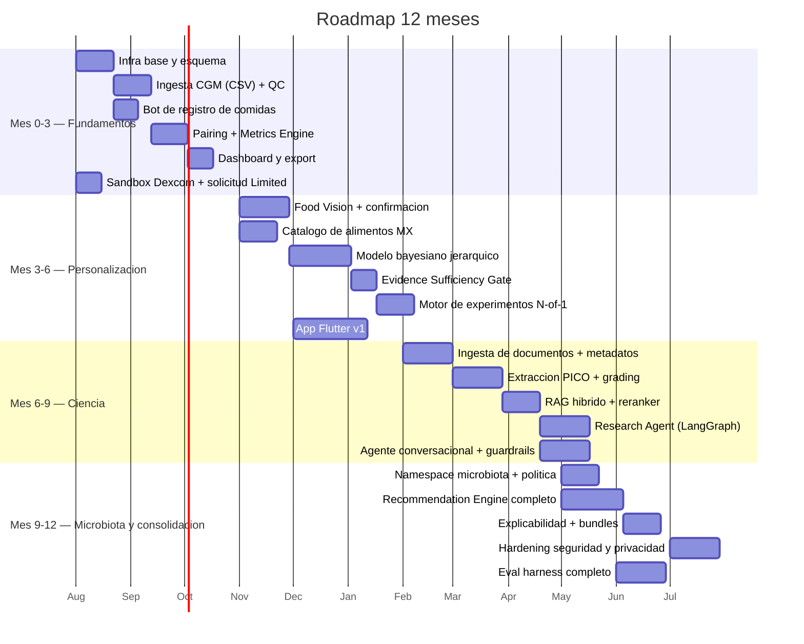

# 09 — MVP, roadmap y riesgos

## 1. Qué construiría primero (y por qué)

> **El pipeline determinista comida ↔ curva glucémica, con un visor decente y cero LLM en la
> ruta crítica.**

La razón no es de ingeniería, es epistemológica: **si `meal_glucose_response` está sucia, todo
lo demás es teatro.** El RAG científico, los agentes y el motor de recomendaciones son capas
sobre esa tabla. Construirlos antes de saber que puedes producir ventanas glucémicas limpias
es construir sobre arena.

Además, es el componente que te dice, en 3–4 semanas y con tus propios datos, si el producto
es viable: **¿qué porcentaje de tus comidas produce una ventana analizable?** Si es el 30%, el
problema real es la UX de registro y la adherencia al sensor, no la IA.

**Semana 1–4, concretamente:**

1. `docker compose up` con Postgres + MinIO. Esquema mínimo: `app_user`,
   `cgm_sensor_session`, `glucose_reading`, `meal`, `meal_item`, `meal_glucose_response`.
2. Parser de CSV de LibreView → ingesta idempotente. Detección de sesiones de sensor.
3. Bot de Telegram: foto + texto + hora → `meal`. Sin visión todavía; el texto lo escribes tú.
4. Meal-Window Pairing Engine + Metrics Engine, con **tests de oráculo** sobre curvas
   sintéticas de iAUC conocido analíticamente.
5. Panel en Grafana: curva del día con comidas superpuestas, tabla de respuestas, y —lo más
   importante— **el ratio de ventanas válidas**.

Con eso ya tienes más de lo que ofrece cualquier app comercial de CGM, y ni una línea de LLM.

---

## 2. Fases

### Fase 1 — MVP funcional (mes 1–3)

| | |
|---|---|
| **Objetivo** | Producir una tabla `meal_glucose_response` limpia y confiable con datos reales |
| **Funcionalidades** | Ingesta CSV LibreView · registro de comidas por bot (foto+texto+hora) · pairing + métricas · QC de señal · dashboard · export |
| **Componentes** | FastAPI monolito · Postgres · MinIO · arq · Grafana · bot Telegram |
| **Modelos** | Ninguno obligatorio. Opcional: Qwen3.6-27B para transcribir la descripción a items estructurados |
| **Infra** | 1 host. GPU opcional en esta fase |
| **Esfuerzo relativo** | **1×** (referencia) |
| **Riesgos** | El ratio de ventanas válidas puede ser bajo → rediseñar UX de registro. El parser de CSV puede cambiar de formato |
| **Dependencias** | Comprar sensores Libre (≥ 3 meses de cobertura continua) |
| **Criterio de salida** | ≥ 60% de comidas con ventana válida, ≥ 60 respuestas válidas acumuladas, métricas verificadas contra cálculo manual |

### Fase 2 — Personalización (mes 3–6)

| | |
|---|---|
| **Objetivo** | Pasar de "aquí están tus datos" a "esto es lo que tus datos soportan afirmar" |
| **Funcionalidades** | Modelo bayesiano jerárquico · Evidence Sufficiency Gate · claims personales con grado · visión de alimentos con confirmación · catálogo de alimentos MX · motor de experimentos N-of-1 · app Flutter v1 |
| **Componentes** | + NumPyro · + Food Vision Service · + Nutrition Resolver · + Experiment Engine · + vLLM |
| **Modelos** | Qwen3.6-27B (texto + visión) · Qwen3-Embedding |
| **Infra** | 1× RTX 4090 24 GB, 64 GB RAM |
| **Esfuerzo relativo** | **2.5×** |
| **Riesgos** | ⚠️ **El principal riesgo del proyecto**: que el ICC observado sea tan bajo que casi ningún claim supere el gate. Mitigación: es un hallazgo válido, y el producto pivota hacia experimentos N-of-1 explícitos, que es donde la señal existe |
| **Dependencias** | Fase 1 con ≥ 100 respuestas válidas · dataset de fotos etiquetadas con báscula (~200) |
| **Criterio de salida** | ≥ 1 claim de grado B emitido y verificable manualmente · ≥ 1 experimento N-of-1 completado · MAPE de visión medido |

### Fase 3 — Research Agent y base científica (mes 6–9)

| | |
|---|---|
| **Objetivo** | Trazabilidad científica real, no citas decorativas |
| **Funcionalidades** | Ingesta de documentos (PDF/DOCX/URL/DOI) · resolución de metadatos Crossref/OpenAlex · extracción PICO · evidence grading GRADE · claims con aristas de conflicto · RAG híbrido · Research Agent con vigilancia semanal · agente conversacional con citación verificada |
| **Componentes** | + pgvector + FTS · + reranker · + LangGraph (research) · + Pydantic AI (chat) · + cola de revisión humana |
| **Modelos** | + reranker · + NLI cross-encoder · Qwen3.6 en modo thinking para extracción |
| **Infra** | Igual; presupuesto de tokens para el batch científico |
| **Esfuerzo relativo** | **3×** |
| **Riesgos** | Alucinación bibliográfica (mitigada por resolución obligatoria de DOI) · prompt injection vía PDF · coste de GPU del batch · **carga de revisión humana** — puede volverse el cuello de botella |
| **Dependencias** | API keys de NCBI · corpus semilla de 100–300 papers curados a mano |
| **Criterio de salida** | 0 citas no verificables en 100 respuestas · ≥ 1 conflicto entre estudios representado y mostrado correctamente |

### Fase 4 — Conocimiento de microbiota (mes 9–12)

| | |
|---|---|
| **Objetivo** | Añadir la dimensión sin degradar el rigor |
| **Funcionalidades** | Namespace `microbiome` con grading estricto · distinción subrogado/clínico/mecanístico · ingesta de resultados de secuenciación · explicaciones mecanísticas acotadas · lista negra de vocabulario pseudocientífico |
| **Componentes** | + política de dominio en el grader · + guardrail léxico |
| **Modelos** | Sin modelos nuevos |
| **Infra** | Sin cambios |
| **Esfuerzo relativo** | **1×** |
| **Riesgos** | 🔴 **El mayor riesgo reputacional del proyecto.** La literatura es mayoritariamente grado 1–2, con revisiones sistemáticas recientes reportando pocos estudios, riesgo de sesgo moderado y falta de estandarización. La tentación comercial de sobre-afirmar es enorme |
| **Dependencias** | Fase 3 completa. **No adelantar esta fase** — sin la infraestructura de grading, la microbiota se convierte en generación de plausibilidad |
| **Criterio de salida** | 0 afirmaciones de microbiota sin grado explícito · 0 recomendaciones cuya justificación primaria sea un claim mecanístico |

### Fase 5 — Modelos predictivos avanzados (mes 12+)

| | |
|---|---|
| **Objetivo** | Mejorar la predicción cuando ya haya datos que lo justifiquen |
| **Funcionalidades** | Modelo poblacional multiusuario · features estilo Zeevi (si hay microbioma) · clustering de formas de curva · GBM personalizado como *comparador* del bayesiano · detección de anomalías avanzada |
| **Componentes** | + feature store · + registro de modelos · + framework de A/B |
| **Modelos** | GBM/LightGBM · posible fine-tune ligero |
| **Infra** | 2× GPU o cloud para entrenamiento |
| **Esfuerzo relativo** | **3×** |
| **Riesgos** | Sobreajuste con pocos usuarios · pérdida de interpretabilidad · **la ganancia puede ser nula frente al jerárquico** — es una hipótesis a validar, no una certeza |
| **Dependencias** | ≥ 50 usuarios con ≥ 100 comidas cada uno. Zeevi usó n=800 |
| **Criterio de salida** | El modelo nuevo supera al jerárquico en calibración *out-of-sample*, o se descarta |

---

## 3. Roadmap para equipo pequeño (1–3 personas)

### Hitos a 3 / 6 / 12 meses

| Horizonte | Debe estar hecho | Pregunta que se responde |
|---|---|---|
| **3 meses** | Pipeline CGM→comida→métricas funcionando con tus propios datos. Dashboard. Métricas verificadas manualmente. Solicitud de acceso Dexcom enviada | *¿Puedo producir datos limpios de respuesta glucémica de forma sostenible?* |
| **6 meses** | Modelo bayesiano + Evidence Gate emitiendo (o bloqueando) claims. Visión con confirmación. Primer N-of-1 completado. App Flutter usable | *¿Existe señal personal detectable por encima del ruido, y cuántos datos hace falta?* |
| **12 meses** | Base científica con trazabilidad completa. Research Agent en producción. Recommendation Engine con explicaciones. Microbiota acotada. 5–20 usuarios piloto | *¿Puede el sistema dar consejo trazable, con incertidumbre honesta, que la gente siga?* |

**Consejo de secuenciación**: si en el mes 3 el ratio de ventanas válidas es bajo, **no
avances a la Fase 2**. Invierte otro mes en la UX de registro y en la adherencia al sensor.
Es tentador saltar a la parte de IA porque es más divertida; sería el error clásico de este
tipo de proyecto.

---

## 4. Riesgos

### 4.1 Técnicos

| Riesgo | Prob. | Impacto | Mitigación |
|---|---|---|---|
| Baja calidad de datos (gaps, sensor despegado, registro incompleto) | **Alta** | Alto | QC explícito, ratio de ventanas válidas como métrica de producto, recordatorios |
| Adherencia del usuario al registro de comidas cae | **Muy alta** | Alto | Fricción mínima (foto + un tap), quick-picks aprendidos, no exigir precisión |
| MAPE de visión ~36% contamina el modelo | Alta | Alto | Confirmación obligatoria, porciones calibradas por usuario, propagación de varianza |
| Cambio del formato CSV de LibreView | Media | Medio | Parser tolerante + tests con fixtures reales |
| Denegación o demora del acceso Dexcom | Media | Bajo | El CSV es el camino principal; Dexcom es opcional |
| Coste de GPU del batch científico | Media | Medio | MoE para pre-cribado, presupuesto de tokens, opción híbrida |
| Prompt injection vía PDF o web | Media | **Alto** | Separación datos/instrucciones, sin tools destructivas, gate determinista |
| Deriva de modelo al actualizar Qwen | Media | Medio | Eval harness en CI, suites de seguridad bloqueantes |
| Sobreingeniería temprana | **Alta** | Alto | Los umbrales de migración documentados en 01-arquitectura §9.2 |

### 4.2 Científicos

| Riesgo | Prob. | Impacto | Mitigación |
|---|---|---|---|
| 🔴 **La señal personal es demasiado débil para detectarla** (ICC 0.14–0.31) | **Alta** | **Crítico** | Umbral n≥8 dinámico, ROPE, experimentos N-of-1. **Si no hay señal, decirlo es el resultado correcto** |
| Confusión por hora del día / actividad / comida previa | **Muy alta** | Alto | Covariables obligatorias, DAG explícito, aleatorización |
| Falso descubrimiento por comparaciones múltiples | Alta | Alto | Jerárquico bayesiano (encoge automáticamente), no p-hacking, ROPE |
| Interpretar correlación como causalidad | Alta | Alto | Campo `design` obligatorio, verbos forzados por regla |
| Extrapolar de un usuario a otro | Media | Alto | Estructura del modelo lo impide por construcción |
| Sobre-afirmar en microbiota | **Alta** | **Alto reputacional** | Política de dominio, techo de grado, prohibición de justificación mecanística |
| Citar un artículo retractado | Media | Alto | Chequeo periódico + notificación de corrección |
| El sistema optimiza glucemia a costa de nutrición | Media | Alto | Objetivo multiobjetivo con adecuación nutricional y variedad |

### 4.3 Regulatorios y de responsabilidad

| Riesgo | Prob. | Impacto | Mitigación |
|---|---|---|---|
| 🔴 Deriva funcional hacia dispositivo médico | **Media** | **Crítico** | Checklist de clasificación por función; límites duros en código |
| México clasifique todas las apps de salud como dispositivo médico | Media | Alto | Monitorizar COFEPRIS; mantener distancia máxima de la frontera; documentación estilo ISO 14971 desde ya |
| Incumplimiento LFPDPPP con datos sensibles (**sanciones duplicadas**) | Media | Alto | Aviso de privacidad conforme, consentimiento expreso y granular, minimización, auditoría |
| Usuario con T1D dosifica insulina con un carbohidrato estimado | Baja | **Crítico** | Modo restringido, rechazo de consultas de dosificación, rangos y no cifras |
| Uso de API no oficial (LibreLinkUp) en producto | Baja (si sigues la recomendación) | Alto | No usarla en producto; sólo en desarrollo propio |
| Transferencia de datos a terceros (agregador, LLM cloud) sin base legal | Media | Alto | Datos de usuario nunca salen; DPA si algún día se usa un tercero |
| Retraso en atención médica del usuario | Baja | **Crítico** | Reglas de derivación deterministas, nunca tranquilizar sobre síntomas |

---

## 5. Las tres preguntas que deciden el proyecto

Todo lo anterior existe para responder tres preguntas, en este orden. Si una falla, las
siguientes no importan.

1. **(Mes 3) ¿Puedo generar datos limpios de forma sostenible?**
   Métrica: `pairing_valid_ratio ≥ 60%` durante 4 semanas continuas.
   Si falla: es un problema de UX y adherencia, no de IA.

2. **(Mes 6) ¿Hay señal personal por encima del ruido?**
   Métrica: al menos un `PersonalClaim` de grado B con HDI que excluya la ROPE, replicado en
   un N-of-1.
   Si falla: el producto no es "descubre tus alimentos", es "haz experimentos sobre ti mismo" —
   un pivote válido y probablemente más honesto.

3. **(Mes 12) ¿La recomendación cambia el comportamiento y mejora el resultado?**
   Métrica: adherencia a recomendaciones seguidas, y reducción del iAUC medio en comidas
   recomendadas vs. no recomendadas — evaluado *prospectivamente*, no en el histórico.
   Si falla: tienes un instrumento de medición excelente, que ya es un producto.
